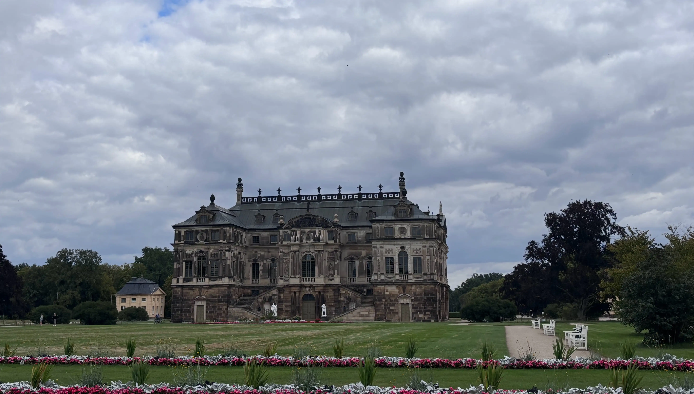
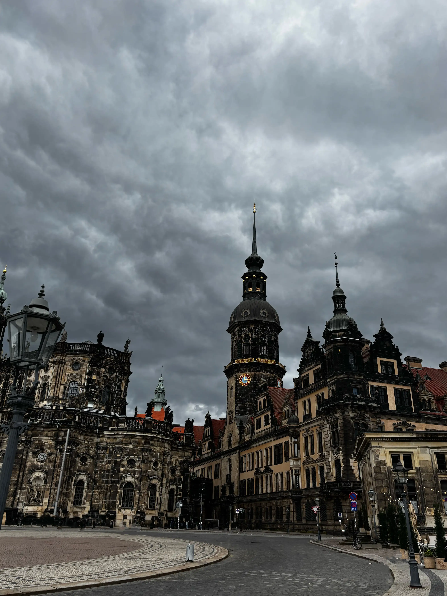
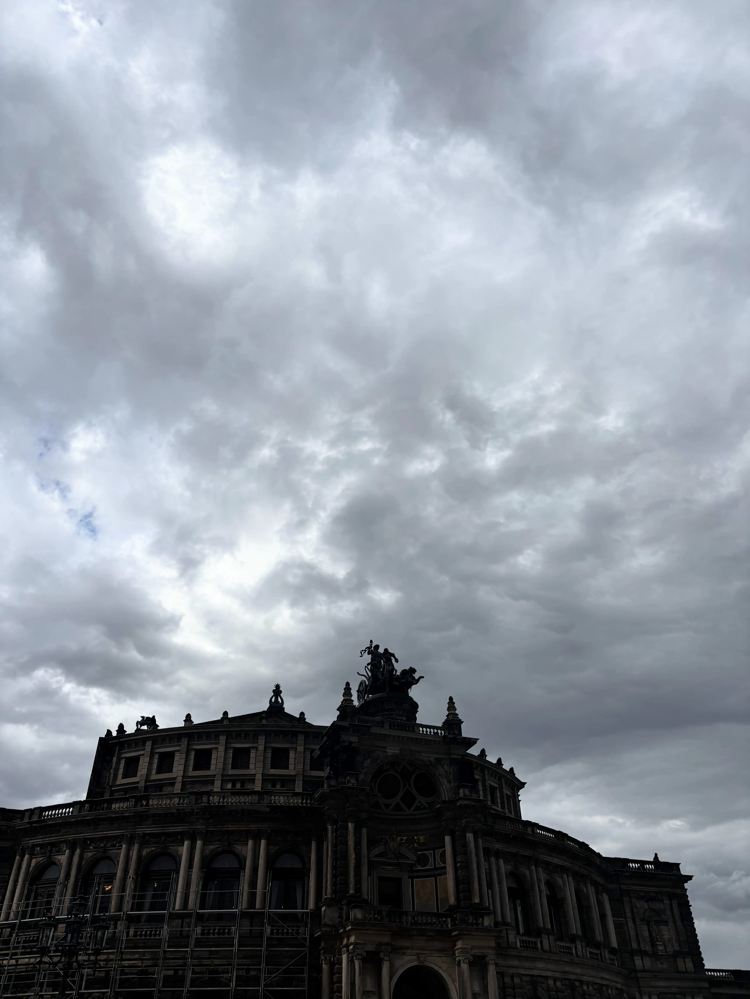
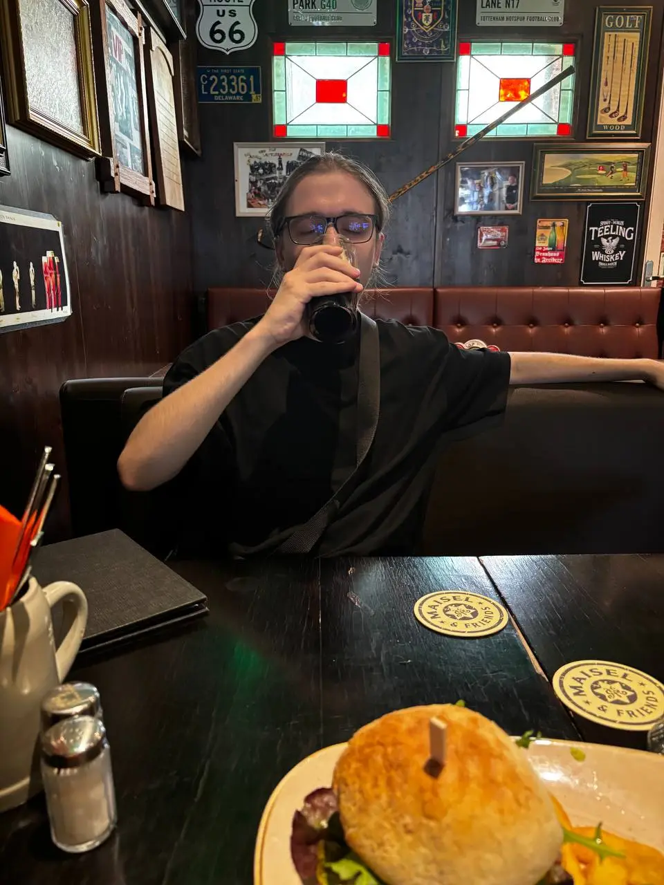
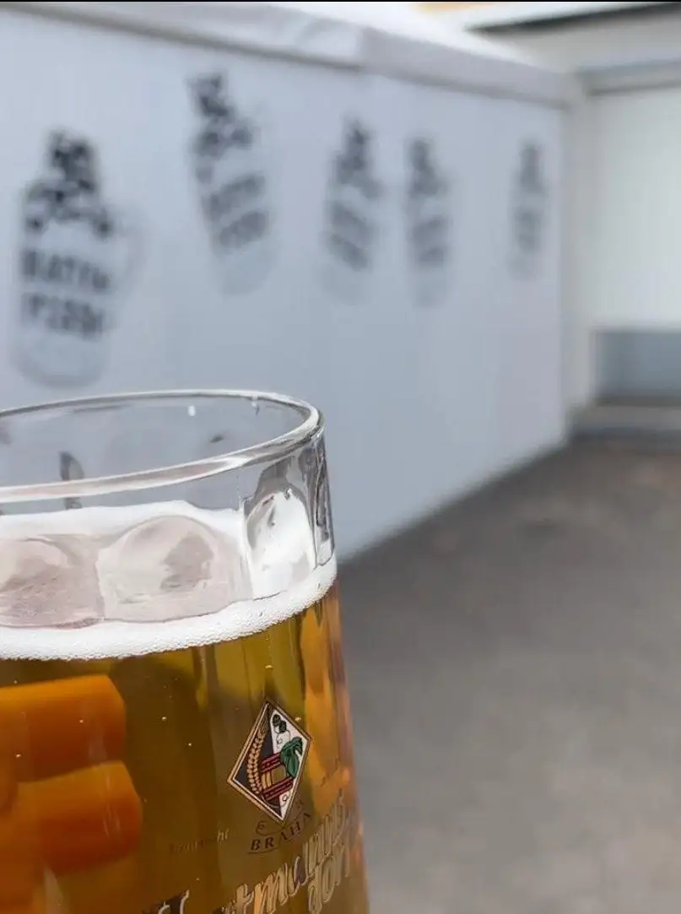
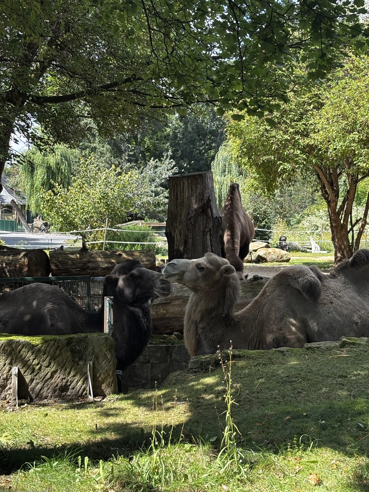
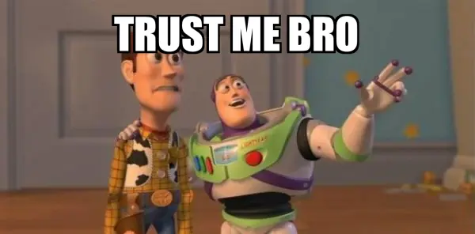
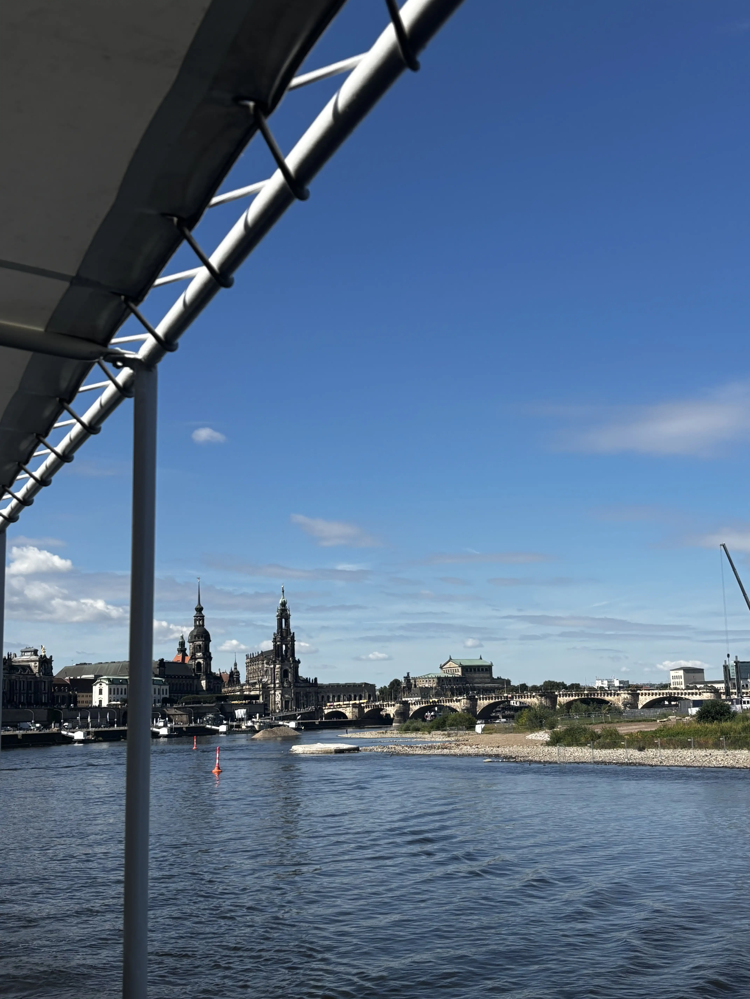
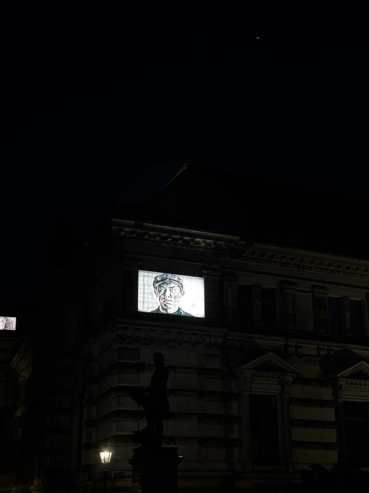

Normalerweise bin ich der Typ, der die meiste Zeit zu Hause verbringt und darüber diskutiert, ob es sich überhaupt lohnt, rauszugehen. Also ja... auf Reisen zu gehen fühlt sich wie ein richtig großes Ding an. Dresden wird ein Mix aus Schlendern, kleinen Überraschungen, schrägen Begegnungen und natürlich Bier. Viel Bier.

Erwartet von dieser Notiz nichts Ernstes — nur als Warnung 😋

## Grand Garden Palace
Erster Halt: Grand Garden Palace und der Park drumherum. Schön, natürlich. Durch den Park fährt ein winziger Zug — extrem verlockend. Bin ich mitgefahren? Nope. Konnte nicht rechtfertigen, so kindisch zu sein... vielleicht nächstes Mal. 🥲

Dann kommt der Polaroid-Moment (ich glaube, es war ein Polaroid?). Ein älteres Paar gibt mir ihre Vintage-Kamera und erwartet, dass ich ein Foto schieße. In meinem Kopf: „Klick = Foto“ wie beim Handy. Realität: nope. Auf der Kamera muss man den Knopf halten. Drücke, loslassen, nichts. Noch einmal drücken, loslassen... nichts. Und jedes Mal kommen sie zurück, um zu checken, ob das Foto fertig ist. Typ beim fünften Versuch war so:

Tag endet auf der Terrasse mit Aussicht, einem Drink und einem dieser langen Gespräche, die dich mehr über dein Leben nachdenken lassen als sonst. Zeit weg hat diese seltsame Art, Reflexion zu erzwingen. Man fragt sich: Was passiert gerade? Wo geht's als Nächstes hin? Und warum bin ich nicht einfach mit dem kleinen Zug gefahren? 😔

## Total einzigartiger Weg
Nächster Tag: Altstadt. Theaterplatz, Frauenkirche, Dresdener Hofkirche... all diese barocken Postkarten werden lebendig.
|                       |                                         |                                         |
|-----------------------|-----------------------------------------|-----------------------------------------|
|  |  |  |

Nach dem Sightseeing ging's weiter zum ersten offiziellen Ritual der Reise: ein Irish Pub. Und mal ehrlich — warum hat jedes Irish Pub immer einen Fernseher mit Fußball? Jedes. Einzelne. Mal. Ist das wegen der Menge an Spielen? Irgendein Irish-Pub-Gesetz? Keine Ahnung. Atmosphäre top, also beschwer ich mich nicht. Gemütlich, laut, lebendig... genau richtig.

Ja, das ist Coca-Cola. Woher weißt du das?

## Katzenpisse
Manche Tage sind einfach fürs Schlendern da. Irgendwie stolpern wir über das [Katzenpisse](https://www.kulturkalender-dresden.de/festival/karierte-katze) Festival, einfach, weil wir durch Straßen laufen, die wir noch nicht kannten. Zufällig, schräg und perfekt. Dieser Tag bestätigt etwas, das ich sowieso schon wusste: strikte Pläne sind überbewertet, Bier nicht. Schlendern ist besser, vor allem mit guter Gesellschaft. Jede Straße, jedes Festival, jede Ecke wird unterhaltsam. People > Places. Immer.

|       |       |
|-------|-------|
|  |  |

Ach ja, und es gab Musik! 🙈

## Zoo
Zoo-Tag! Normalerweise nicht mein Ding, aber Dresdens Zoo hat Pinguine. Pinguine sind objektiv niedlich. Der Tag liefert eine absurde Menge an Fotos — die meisten bleiben privat. Ehrlich, wen interessiert's?  Anyways, hier ein paar Highlights:

|                       |                        |                       |
|-----------------------|------------------------|-----------------------|
|  |  |  |

Danach völlig erledigt umherlaufen? Kein Problem — am Ende gibt's natürlich ein Bier. Fühle mich, als könnten alle mich jetzt schon als „Drunky“ sehen 🌚 — obwohl ich eigentlich kaum trinke.

Low-key pa~~ran~~laroid deswegen, low-key alles gut.

## Sächsische Dampfschifffahrt
Und dann die [Sächsische Dampfschifffahrt](https://www.saechsische-dampfschifffahrt.de/). Die Boote die ganze Woche beobachten und widerstehen? Unmöglich. Ticket gekauft. Hauptinteresse: Bier an Bord. Nebensache: Aussicht auf die Stadt. Deutsche Städte sind so funny — alles gotisch/renaissance/barock, und doch überrascht es immer wieder.

|       |       |       |
|-------|-------|-------|
|  |  |  |

Später, beim Chillen in der Wohnung, fällt mir wieder auf: Das ~~Leute~~ Bier, mit dem du unterwegs bist, zählt mehr als Plan, Sehenswürdigkeiten oder perfekter Sonnenuntergang.

Ach ja, hatte ich erwähnt, dass es eine **geführte Flussfahrt** war?

## Dresden bei Nacht
Dresden bei Nacht verdient einen eigenen Absatz. Straßenkünstler, Statuen überall, ruhige Straßen, die trotzdem cozy und still wirken. Laufen und quatschen... Worte fehlen.

Beim Vorbeigehen an all diesen Statuen frage ich mich, ob eine meinen Bierkonsum bewertet. Wahrscheinlich.

Aus Angst vor der Urteilskraft der Statuen gibt's davon keine Fotos in meiner Library. Nur random Bilder und ein Video:

|       |       |       |       |
|-------|-------|-------|-------|
|  |  |  |  |

## Das musst du wissen
Museen? Anderer Story — vier Stunden kratzen kaum an der Oberfläche. Sushi dazu (erstes Mal seit einem Jahr!) und klar, noch ein Bier. Tradition gepflegt. Integration in Deutschland: Check. ☝️

Keine Beweise mehr fürs Trinken, ich muss ja später irgendwas zum Entschuldigen haben 🥾🔄

|       |       |       |
|-------|-------|-------|
|  |  |  |

Vor der Abreise noch ein paar Bier in irgendeinem Bar-Restaurant. Irgendwie wird das zum täglichen Ritual. Beste Beschreibung:

<iframe src="https://www.youtube-nocookie.com/embed/oX1vp-fblx8?si=l3bh4tqDswrGLjJ8&amp;start=27" title="YouTube video player" frameBorder="0" allow="accelerometer; autoplay; clipboard-write; encrypted-media; gyroscope; picture-in-picture; web-share" referrerPolicy="strict-origin-when-cross-origin" allowFullScreen></iframe>

## Vielleicht wichtig
Fazit? Schlendere ohne strikten Plan. Genieße die Zufälle — Pinguine, Festivals, winzige Züge, Polaroid-Fails. Nimm es nicht so ernst. Leute zählen mehr als Orte. Und verpass auf keinen Fall die Chance, mal in so einen Mini-Zug zu springen, wenn du Lust hast. Ernsthaft.

Und in Deutschland ist Bier quasi ein Pflicht-Reiseaccessoire. Macht einfach alles besser.
