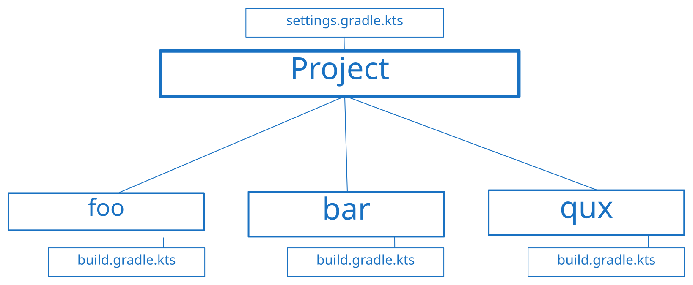

Beim Entwickeln mit Kotlin steht jeder Anfänger vor dem Problem, die geeigneten Tools für die Arbeit mit der Programmiersprache nicht zu verstehen. Dafür wurde dieser Artikel erstellt – um die Funktionsweise von Gradle für Kotlin und auf Kotlin zu erklären. Los geht's!

> ❓ **Definition** <br/>
> **Gradle** ist ein System zur Automatisierung des Zusammenbaus, einschließlich Bauen und Kompilieren. Es ist für komplexe Build-Workflows konzipiert, bei denen die Aufgabe nicht nur darin besteht, den Code auszuführen, sondern auch eine benutzerdefinierte Build-Logik zu erstellen, Multi-Modul-Projekte zu verwalten und sich in Continuous-Integration-Systeme zu integrieren.

Aber fangen wir mit etwas Einfachem an – wie erstellen wir unser erstes Projekt mit Gradle?

## Projekt
Beginnen wir mit dem grundlegenden Konzept, das im Anwendungserstellungssystem existiert – Projekt.

### Definitionen

> **Projekt** ist eine unabhängige Einheit der Anwendungsorganisation als Menge von abhängigen Modulen und Regeln für diese.

> **Modul** ist eine unabhängige Einheit der Codeorganisation, die eine bestimmte Menge von Regeln besitzt (wie es gebaut wird usw.). Existiert für denselben Zweck wie Pakete in Kotlin – um den Code in logische Blöcke zu unterteilen, um die Qualität des Quellcodes zu verbessern (Wiederverwendung von Code, sowohl in einem Projekt als auch in anderen).

Von welchen Regeln spreche ich? Tatsächlich ist alles sehr einfach – wir beschreiben, wie unser Projekt gebaut wird (Beschreibung der technischen Merkmale), für welche Plattform (z. B. Android oder iOS), in welcher Sprache und mit welchen Mitteln (Projektabhängigkeiten).

### Struktur
Erstellen wir eine Beispielprojektstruktur:

> P.S.: Die Namen im Beispiel haben keinen besonderen Sinn, es ist nur Terminologie von [Foobar](https://wikipedia.org/wiki/Foobar).

Alle Module müssen `build.gradle.kts` enthalten, um zu funktionieren. Es ist wichtig zu beachten, dass Module nicht allein existieren können und nur funktionieren, wenn wir sie explizit über `settings.gradle.kts` in unser Projekt aufnehmen.

Wie du siehst, haben wir eine Art "Oberaufseher", der bestimmt, welche Module in unserem Projekt sein werden und wie sie funktionieren werden, und "lokale Aufseher", die Regeln nur für den ihnen untergeordneten Code (Module) festlegen, aber es ist erwähnenswert, dass **Projekt** bei Regeln eine höhere Priorität hat als Module (aber das werden wir in diesem speziellen Artikel nicht behandeln).

Welche Regeln gibt es? Tatsächlich gibt es viele davon – es hängt alles davon ab, was du tust, aber die grundlegenden sind zum Beispiel:
- Projektname, Version, Gruppe (ein Bezeichner, der eine Art Paket von Kotlin ist)
- Programmiersprache (Java / Scala / Groovy / Kotlin / etc.)
- Plattform (nur relevant für Kotlin, genauer gesagt für das Kotlin Multiplatform Plugin)
- Abhängigkeiten (Bibliotheken oder Frameworks, die im Code verwendet werden)

## Module
Betrachten wir die Module: wie und womit sie genutzt werden. Lass mich daran erinnern, was ein Modul ist:
> ❓ **Definition** <br/>
> **Modul** ist eine unabhängige Einheit der Codeorganisation, die eine bestimmte Menge formaler Regeln besitzt, die das Verhalten des Moduls definieren.

Nehmen wir als Beispiel das `foo`-Modul:

Um ein Modul zu erstellen, erstellen wir zunächst die Verzeichnisse dieses Moduls. Danach erstellen wir eine Datei mit dem Namen `build.gradle.kts` (oder `build.gradle`, wenn du Groovy als Skriptsprache verwendest, anders geht es nicht), in der wir bereits festlegen, was unser Modul tun kann.
### `build.gradle.kts`
Unsere Einstellungsdatei hat die folgende Struktur:

Keine Angst! Auch wenn es ziemlich kompliziert aussieht. 😄

Die Hauptkomponente in jeder `build.gradle.kts` ist der **Plugins**-Block. Die Blöcke **Dependencies** und **Repositories** sind unabhängig vom Plugins-Block, aber ohne ihn sind sie wie Komiker, die Witze in einem leeren Theater erzählen – sie mögen großartiges Material haben, aber es gibt keine Bühne, kein Publikum und kein Lachen.

Plugins, die auf dein Modul angewendet werden, verbrauchen in der Regel das, was du im **Dependencies**-Block angegeben hast. Daher sind Abhängigkeiten ohne Plugins, die sie verwenden, nutzlos, weshalb Abhängigkeiten in unserem Schema eine Verbindung zu Plugins haben.

**Repositories** sind an sich nicht von Plugins abhängig, aber du benötigst sie immer, um Abhängigkeiten oder Plugins auf dein Projekt anzuwenden. Daher ist es ohne Plugins oder Abhängigkeiten sinnlos, zu existieren. Um unsere vorherige Analogie zu verwenden, ist es so, als hätte man ein Theater voller Menschen ohne Komiker auf der Bühne.

**Aufgaben** sind ebenfalls eine grundlegende Sache in deinen Gradle-Konfigurationsdateien. Sie werden immer von Plugins bereitgestellt, die du auf dein Modul anwendest. In einem leeren Modul ohne Plugin hast du keine Aufgaben. Es gibt jedoch einige grundlegende Aufgaben, die auf Projektebene verfügbar sind:
- `tasks` (gibt eine Liste der verfügbaren Aufgaben im gesamten Projekt zurück: Name, von welchen Aufgaben die Aufgabe abhängt usw.).
- `dependencies` (gibt einen Bericht über die Abhängigkeiten des Projekts aus, der zeigt, welche Abhängigkeiten verwendet werden und ihre Versionen)
- `help` (gibt eine Liste der verfügbaren Aufgaben im gesamten Projekt mit einer kurzen Beschreibung zurück).
- `model` (bietet einen detaillierten Bericht über die Struktur, Aufgaben usw. deines Projekts; hilft dir, deinen Gradle-Build zu verstehen und zu debuggen)
- usw.

> 💡 **Bonus** <br/>
> Aufgaben können von anderen Aufgaben abhängig sein, dies ist besonders nützlich, wenn du das Ergebnis der Ausführung anderer Aufgaben benötigst.

#### Beispiel
Betrachten wir nun ein Beispiel. Erstellen wir zum Beispiel ein Kotlin/JVM-Projekt mit der Bibliothek [kotlinx.coroutines](https://github.com/Kotlin/kotlinx.coroutines) als Abhängigkeit.

Zuerst müssen wir unsere Projektkonfigurationsdatei – `settings.gradle.kts` im Root unseres Projekts – erstellen:
```kotlin
rootProject.name = "our-first-project"
```

Damit es funktioniert, solltest du die Gradle-Synchronisierung in deiner IDE ausführen:


Du kannst entweder einen neuen Ordner für ein neues Modul erstellen oder den Root-Ordner auf die gleiche Weise als Modul verwenden, indem du einfach eine `build.gradle.kts`-Datei im Root-Verzeichnis (`our-first-project/build.gradle.kts`) hinzufügst.

> ❗️ **Wichtig** <br/>
> Wenn wir den Root-Ordner als Modul verwenden, müssen wir ihn nicht explizit zu unserer Projektkonfigurationsdatei hinzufügen, aber für alle neuen Module sollten wir ihn mit der Funktion `include` deklarieren – zum Beispiel `include(":foo")` (für verschachtelte Ordner verwende `include(":foo:bar")`).

Beginnen wir mit `plugins`:
```kotlin
plugins {
	id("org.jetbrains.kotlin.jvm") version "1.9.0"
}
```

> 💡 **Bonus** <br/>
> Wir können die Deklaration von Kotlin-Plugins (wie `jvm`, `android`, `js`, `multiplatform`) mit der `kotlin`-Funktion vereinfachen: `id("org.jetbrains.kotlin.jvm")` -> `kotlin("jvm")`.
> Es fügt automatisch `org.jetbrains.kotlin` am Anfang an.

Kommen wir nun zu den Abhängigkeiten:
```kotlin
dependencies {
	implementation("org.jetbrains.kotlinx:kotlinx-coroutines-core:1.7.3")
}
```

Unser Kotlin/JVM-Plugin bietet uns eine nützliche Funktion – `implementation`. Ohne sie müssten wir explizit einen Konfigurationsnamen (Bezeichner für das Plugin) schreiben, der unsere Abhängigkeiten verbraucht. Wie du dich erinnerst, leben Abhängigkeiten nicht von selbst. Um es klarer auszudrücken, der **Dependencies**-Block bietet nur die grundlegende Möglichkeit, hinzugefügte Abhängigkeiten hinzuzufügen und zu verbrauchen. Wir könnten unsere Abhängigkeit auf folgende Weise hinzufügen (aber wir benötigen immer noch ein Plugin, das sie verbraucht):
```kotlin
dependencies {
	add(configurationName = "implementation", "org.jetbrains.kotlinx:kotlinx-coroutines-core:1.7.3")
}
```

> **configurationName** steht für die Aufteilung von Abhängigkeiten mit verschiedenen Ziel-Plugins (Plugins, die unsere Abhängigkeiten verbrauchen).

Aber wenn wir versuchen, unser Modul zu bauen, werden wir das nächste Problem haben:
```text
Could not resolve all dependencies for configuration ':compileClasspath'. > Could not find org.jetbrains.kotlinx:kotlinx-coroutines-core:1.7.3.
```
Um dieses Problem zu lösen, müssen wir das Repository angeben, aus dem wir unsere Abhängigkeit implementieren möchten. Schauen wir uns das Beispiel an:
```kotlin
repositories {
	// builtins:
	mavenCentral()
	mavenLocal()
	google()

	// oder genauen Link zum Repository angeben:
	maven("https://maven.y9vad9.com")
}
```

> ❓ **Definition** <br/>
> <u>Maven-Repositories</u> – sind wie Online-Shops oder Bibliotheken für Code. Es handelt sich um Sammlungen vorgefertigter Softwarebibliotheken und Abhängigkeiten, die du einfach in deinen Projekten verwenden kannst. Diese Repositories bieten eine zentralisierte und organisierte Möglichkeit, Code zu teilen und zu verteilen.
>
> Außerdem ist es wichtig zu beachten, dass Maven _ein weiteres Build-Tool_ mit integrierter Unterstützung von Gradle ist.

Aber für unseren Fall benötigen wir nur `mavenCentral()`. Unser resultierendes `build.gradle.kts` ist also:
```kotlin
plugins {
	kotlin("jvm") version "1.9.0"
}

repositories {
	mavenCentral()
}

dependencies {
	implementation("org.jetbrains.kotlinx:kotlinx-coroutines-core:1.7.3")
}
```

Für ein solches Beispiel müssen wir keine Aufgaben berühren. Es wäre jedoch gut zu erwähnen, dass unser Kotlin-Plugin die folgenden Aufgaben bereitstellt:
- `compileKotlin`
- `compileJava`
- usw.

Normalerweise musst du diese Aufgaben jedoch nicht direkt aufrufen, es sei denn, du entwickelst dein eigenes Plugin, das von den Ergebnissen/Ausgaben dieser Aufgaben abhängt.

> 💡 **Bonus** <br/>
> Du kannst Gradle-Aufgaben entweder über die Kommandozeile oder über die IDE ausführen:
>
> 
> Als Beispiel habe ich die Aufgabe `gradle build` genommen.

Eine vollständige Erklärung der Aufgaben und deren Verwendung werden wir vorerst überspringen. Ich werde sie in den nächsten Artikeln behandeln.

Kommen wir nun endlich dazu, wie und wo wir unseren Code schreiben können.

### Source-Sets
Wir haben herausgefunden, wie man ein Projekt und Module erstellt, aber wo sollen wir den Code schreiben? In Gradle-Projekten gibt es das Konzept verschiedener Quellcodesätze (Source-Sets) – eine Art Trennung des Codes für verschiedene Bedürfnisse. Für unser vorheriges Beispiel existieren beispielsweise die folgenden Sätze standardmäßig:
- `main` – Der Name sagt es schon, es ist der Hauptort, an dem Code platziert werden sollte.
- `test` – Wird für Code verwendet, der mit Tests zusammenhängt. Er ist vom `main`-Source-Set abhängig und verfügt über alle Abhängigkeiten / den Code, den du in `main` geschrieben hast.

> 💡 **Bonus** <br/>
> Dies ist jedoch nicht immer der Fall, zum Beispiel haben [Kotlin/Multiplatform-Projekte](https://kotlinlang.org/docs/multiplatform.html) dedizierte Source-Sets für jede Plattform, für die du schreibst (im Grunde erstellt das Plugin einen Satz von Source-Sets für alle Plattformen, die wir benötigen). Daher ist es wichtig zu erwähnen, dass es immer von den Plugins abhängt, die du auf das Modul anwendest, und von deiner Konfiguration. Es ist keine Konstante.

#### main

Um mit dem Codieren zu beginnen, müssen wir einen Ordner für unsere Programmiersprache erstellen, für Kotlin ist dies der Ordner `src/main/kotlin`. Von nun an können wir einfach unser 'Hello, World!'-Projekt erstellen. Erstellen wir `Main.kt` in unserem kürzlich erstellten Ordner:
```kotlin
fun main() = println("Hello, Kotlin!")
```
Du kannst es mit der IDE ausführen, die den Gradle-Build-Prozess automatisch übernimmt.

#### test
Wie ich dir bereits sagte, wird dieser Quellcode für Testzwecke verwendet. Es ist jedoch wichtig zu erwähnen, dass er eigene Abhängigkeiten hat (aber er forkt sie auch aus dem `main`-Quellcode). Du kannst also Abhängigkeiten implementieren, die in diesem Quellcode verfügbar sind. Implementieren wir zum Beispiel die `kotlin.test`-Bibliothek:
```kotlin
dependencies {
	// ...
	testImplementation(kotlin("test"))
}
```

Du kannst dir das [vollständige Tutorial](https://kotlinlang.org/docs/jvm-test-using-junit.html) in der Kotlin-Dokumentation ansehen, wie du deinen Code mit `kotlin.test` testen kannst.

## Multi-Modul-Projekte
Die Erstellung verschiedener Module erfordert deren Interaktion miteinander. Analysieren wir auch die Arten der Interaktion, wie man es nicht oder nicht tun sollte und worauf es ankommt. Fangen wir an!

Wenn du dich an unsere [ursprüngliche Projektstruktur](#Struktur) erinnerst, hat sie einige Module:
- `foo`
- `bar`
- `qux`

Betrachten wir `foo` als das Hauptmodul, in dem wir unseren Einstiegspunkt zur Anwendung haben (`Main.kt`-Datei). Beginnen wir mit der Erstellung einer Konfiguration für alle drei Module (es wird einfach sein, ohne Abhängigkeiten):
```kotlin
plugins {
	kotlin("jvm") version ("1.9.0")
}

repositories {
	mavenCentral()
}
```

Damit es funktioniert, fügen wir unsere Module zu `settings.gradle.kts` hinzu:
```kotlin
rootProject.name = "example"

include(":foo", ":bar", ":qux")
```

Dann machen wir `foo` abhängig vom `bar`-Modul:
```kotlin
// Datei: /foo/build.gradle.kts

dependencies {
	implementation(project(":bar"))
}
```

> ❗️ **Wichtig** <br/>
> Um ein Modul aus deinem Projekt zu implementieren, solltest du es mit der Funktion `project` angeben. Bei der Implementierung von Modulen oder deren Angabe an anderer Stelle verwenden wir eine spezielle Notation, bei der `/` durch das Symbol `:` ersetzt wird.
>
> Und als Bonus: Um das Root-Modul zu implementieren, verwende einfach `implementation(project(":"))`.

Von nun an können wir jede Funktion oder Klasse aus `bar` innerhalb des `foo`-Moduls verwenden (natürlich, wenn die Sichtbarkeit dieser Deklarationen dies zulässt). Erstellen wir zum Beispiel eine Datei im `foo`-Modul:
```kotlin
package com.my.project

fun printMeow() = println("Meow!")
```

Und wir können es im `foo`-Modul verwenden:
```kotlin
import com.my.project.printMeow

fun main() = printMeow()
```

Aber es kann nicht aus dem `qux`-Modul verwendet werden. Darüber hinaus, wenn wir versuchen, das `foo`-Modul zu implementieren, bleibt `bar` weiterhin unzugänglich. Die Abhängigkeiten des Moduls werden standardmäßig nicht für andere Module freigegeben.

> 💡 **Bonus** <br />
> Wir können Abhängigkeiten für Module teilen, die unser spezifisches Modul implementieren, indem wir die [`api`](https://docs.gradle.org/current/userguide/java_library_plugin.html#sec:java_library_separation)-Funktion anstelle von `implementation` verwenden. Auf diese Weise kann zum Beispiel das `qux`-Modul auf `bar`-Modul-Funktionen/Klassen/usw. zugreifen, indem es `foo` implementiert, ohne explizit vom `bar`-Modul abhängig zu sein.

### Einschränkungen
Stell dir vor, dass du nach dem vorherigen Beispiel eine beliebige Klasse/Funktion/usw. innerhalb von `bar` aus dem `foo`-Modul abrufen musst. Wenn du dies versuchst, wirst du das nächste Problem haben:
```
Circular dependency between the following tasks:
:bar:classes
\--- :bar:compileJava
     +--- :bar:compileKotlin
     |    \--- :foo:jar
     |         +--- :foo:classes
     |         |    \--- :foo:compileJava
     |         |         +--- :bar:jar
     |         |         |    +--- :bar:classes (*)
     |         |         |    +--- :bar:compileJava (*)
     |         |         |    \--- :bar:compileKotlin (*)
     |         |         \--- :foo:compileKotlin
     |         |              \--- :bar:jar (*)
     |         +--- :foo:compileJava (*)
     |         \--- :foo:compileKotlin (*)
     \--- :foo:jar (*)
```
Worum geht es hier? Alles ist einfach – du kannst keine zirkulären Abhängigkeiten erstellen.

Zirkuläre Abhängigkeiten in Gradle sind wie eine Endlosschleife, die deinen Build-Prozess blockiert, weil Aufgaben immer wieder aufeinander warten, die niemals abgeschlossen werden. Es ist wichtig, sie zu vermeiden, um einen reibungslosen Build zu gewährleisten. Darüber hinaus geht es immer darum, das [**Dependency Inversion Principle**](https://en.wikipedia.org/wiki/Dependency_inversion_principle) zu verletzen, was keine gute Praxis ist.

Du kannst dir [diese Diskussion](https://discuss.gradle.org/t/gradle-support-for-cyclic-dependencies/14355) ansehen, um mehr darüber zu erfahren.

> 👨🏻‍🏫 **Bonus für Erfahrene** <br />
> In der Regel, wenn wir zum Beispiel über mobile Anwendungen sprechen, verwenden wir eine Drei-Schichten-Architektur. Es ist also eine gute Idee, diese in verschiedene Module aufzuteilen, um Designregeln durchzusetzen:
> 
> Dies bewirkt zum Beispiel, dass unsere `domain`-Schicht nicht von der `data`-Schicht abhängig ist – es ist buchstäblich unmöglich, da es ein Problem mit zirkulären Abhängigkeiten geben würde.

## Fazit
Es ist nicht nur eine weitere Methode zum Kaffeebrauen; es ist ein leistungsstarkes Build-Automatisierungstool, das deinen Softwareentwicklungsprozess vereinfacht. Mit Gradle kannst du Abhängigkeiten verwalten, Aufgaben automatisieren und deine Projekte gut organisieren. Es ist, als hättest du einen vertrauenswürdigen Assistenten, der sich um die Details kümmert, damit du dich auf das Schreiben von großartigem Code konzentrieren kannst!
