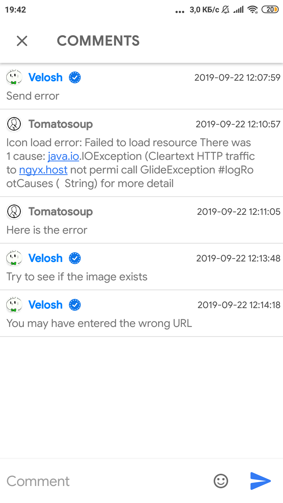
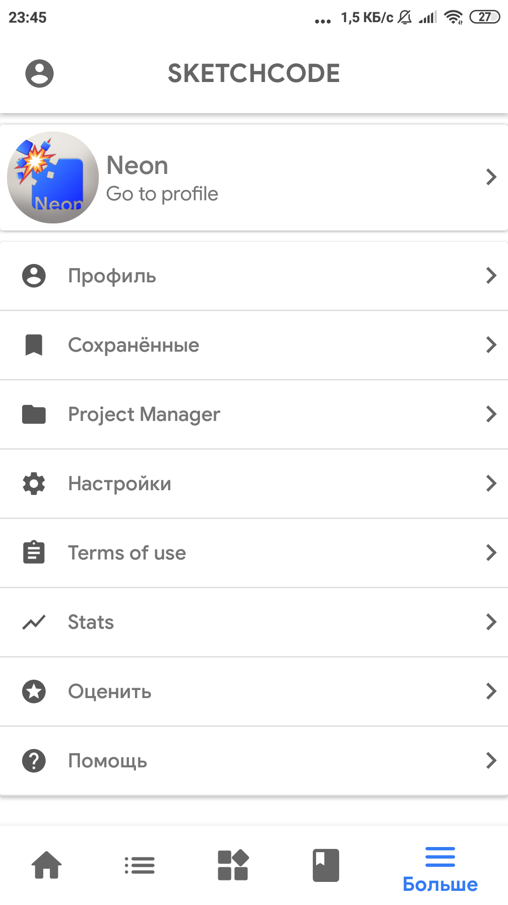
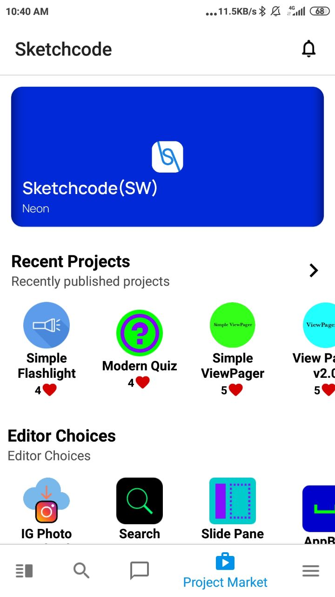

> Im Jahr 2018 habe ich Sketchcode ins Leben gerufen, ein soziales Netzwerk für Entwickler, die [Sketchware](https://sketchware-docs.vercel.app/) nutzen – einen No-Code-Android-App-Builder. Es
> ging nicht nur um das Teilen von Projekten; es wurde zu einem Zentrum für Tutorials, UI-Komponenten und Zusammenarbeit. Auf seinem Höhepunkt
> unterstützte Sketchcode 3.000 aktive Nutzer mit einem knappen Budget. Der Betrieb lehrte mich mehr als nur das Programmieren – es lehrte
> mich Widerstandsfähigkeit und Einfallsreichtum.

## Screenshots
|  |  |  |
| --- | --- | --- |
|  |  |  |
|  |  |  |
|  |  |  |
> Hinweis: Leider habe ich nicht viele Screenshots (einschließlich der Veränderungen der App), daher stelle ich nur die zur Verfügung, die
> ich gefunden habe.

## Geschichte

Sketchcode war mein erstes Projekt — eine App für [Sketchware](https://sketchware-docs.vercel.app/), ursprünglich *in* Sketchware selbst gebaut. Ziemlich schnell stieß sie an die Grenzen von No-Code, also bin ich zu Android Studio und Java gewechselt. So habe ich mit dem Programmieren angefangen.

### Erste große Version (globaler Feed und Custom Blocks)

Im ersten Release gab es drei Dinge:

- Einen globalen Feed zum Teilen und Entdecken von Inhalten.
- Custom Blocks, die man in eigene Projekte einbauen konnte.
- Code-Snippets, damit fortgeschrittene Nutzer über einen eigenen Block reines Java einfügen konnten.

### Zweite große Version (Community und Tutorials)

Hier konnten die Nutzer endlich selbst etwas beisteuern:

- Teilen von Custom Blocks und Snippets.
- Ein Tutorial-Bereich — die ersten Guides habe ich selbst geschrieben.
- Ein UI-Builder, mit dem Nutzer eigene Tutorials schreiben und veröffentlichen konnten.

> Hinweis: Aus dieser Version habe ich keine Screenshots mehr, außer dem unten.

### Dritte große Version (Projekte und private Backups)

- Nutzer konnten ihre Posts und ganze Sketchware-Projekte teilen.
- Private Projekte — für alle, die einfach nur ein Backup wollten.

### Vierte Version (neues UI und Social Features)

- Ein überarbeitetes Interface.
- Kommentare, Likes und andere Social Features im Projects Market.

Am schwierigsten war das Hosting der Projekte. Über 60 GB Serverspeicher, keine Monetarisierung, für alle kostenlos — ich habe viel Zeit damit verbracht, die Dateistruktur umzubauen und Uploads zu komprimieren, damit es bezahlbar blieb.

### Höhepunkt

Auf dem Höhepunkt hatte Sketchcode 3.000–4.000 Nutzer und über 10 Millionen Requests pro Monat. Ich habe eine Menge Nächte daran gesessen.

### Letztes großes Feature (Chat)

Ein einfacher Chat mit Bildern und Stickern, damit die Leute sich direkt in der App unterhalten konnten. Wie das aussah, ist oben im Bilder-Karussell zu sehen.

### Rückblick

Bei Sketchcode habe ich programmieren gelernt. Aus einer Sache, die ich in einer No-Code-App gebaut habe, wurde eine Plattform, die Leute wirklich genutzt haben — und das meiste, was ich heute kann, hat dort angefangen.
