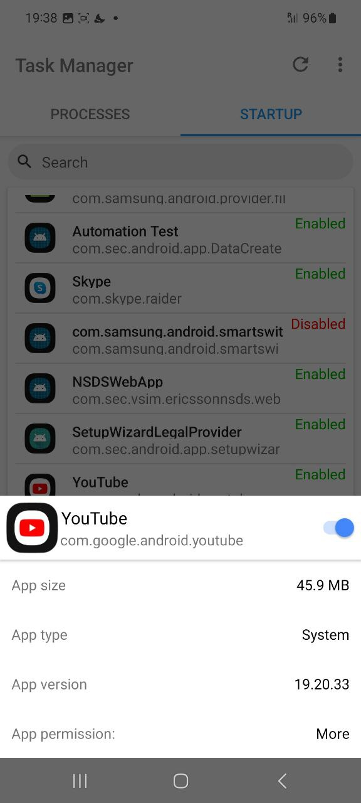

> Der Task-Manager war eine mobile Anwendung, die Benutzern half, die Startanwendungen, aktiven Prozesse und die RAM-Nutzung ihres Geräts zu verwalten. Mit seiner benutzerfreundlichen Oberfläche und leistungsstarken Funktionalität bot er Benutzern eine effiziente Möglichkeit, die Leistung ihres Geräts zu optimieren.

## Funktionen

- **Verwaltung von Startanwendungen**: Anwendungen aktivieren oder deaktivieren, die beim Hochfahren des Telefons starten.
- **Prozessverwaltung**: Laufende Prozesse anzeigen und beenden, um Systemressourcen freizugeben.
- **RAM-Bereinigung**: Speichernutzung optimieren für bessere Leistung.
- **Benutzerfreundliche Oberfläche**: Einfache und intuitive Benutzeroberfläche für eine einfache Navigation.

## Erfolge

- **70.000+ Downloads**: Die App wurde über 70.000 Mal heruntergeladen.
- **7.000 monatlich aktive Benutzer**: Auf ihrem Höhepunkt hatte die Anwendung 7.000 aktive Benutzer pro Monat.

## Screenshots

|                                                                                     |                                                                                 |                                                                                            |
|-------------------------------------------------------------------------------------|---------------------------------------------------------------------------------|--------------------------------------------------------------------------------------------|
|  |  |  |

## Fazit

Der Task-Manager war ein weit verbreitetes Tool zur mobilen Optimierung, das Benutzern half, ihre Geräte reibungslos am Laufen zu halten. Obwohl das Projekt nicht mehr aktiv ist, bleiben seine Auswirkungen und sein Erfolg bemerkenswert.
