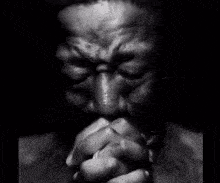
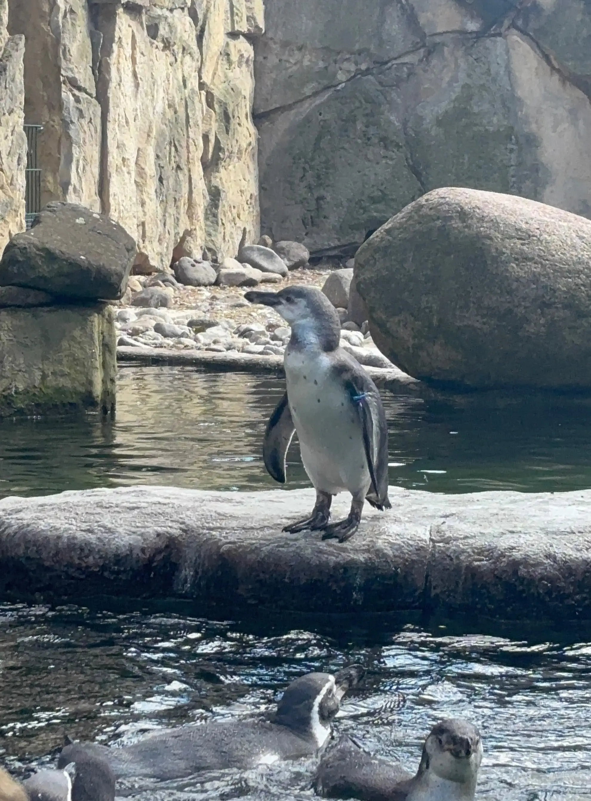
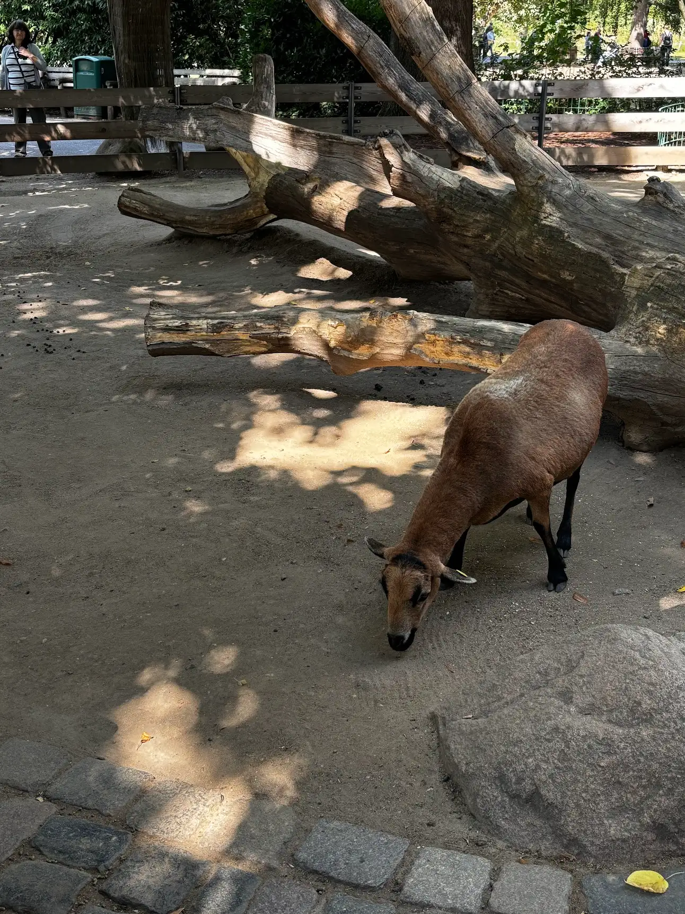
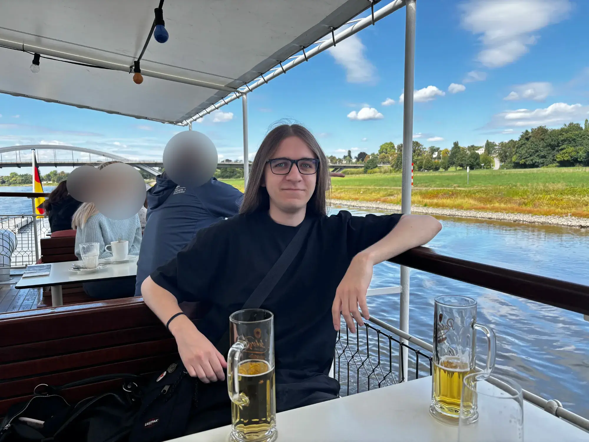
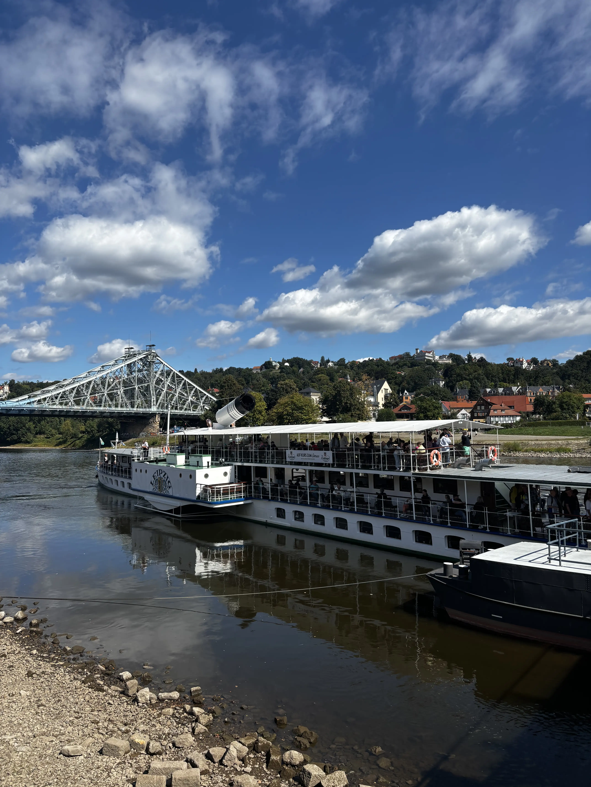
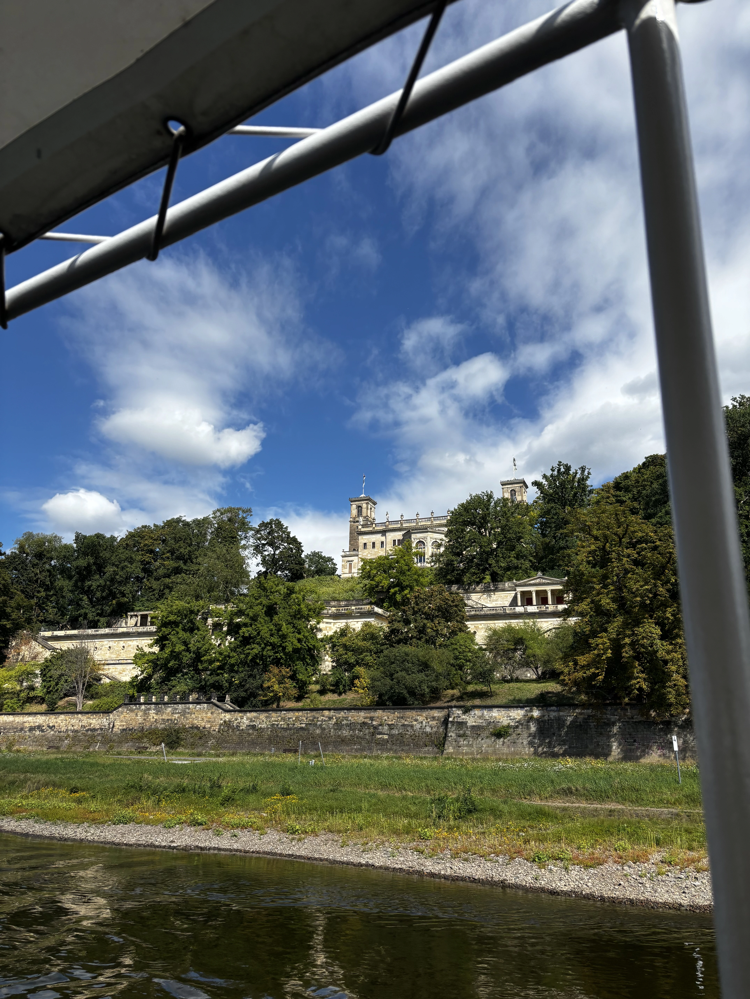
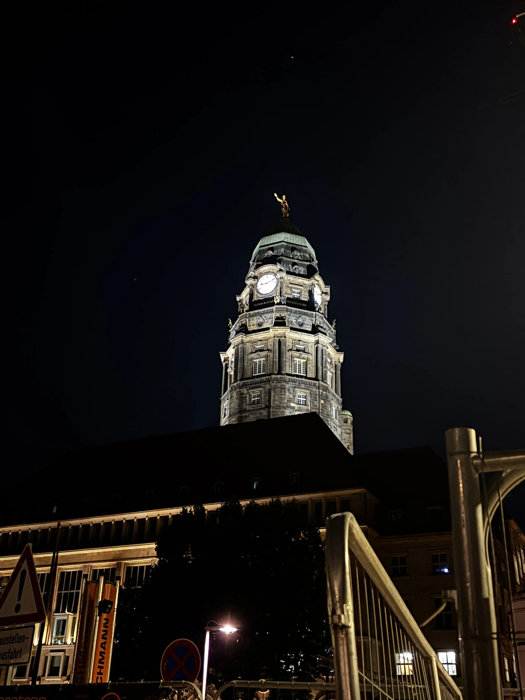
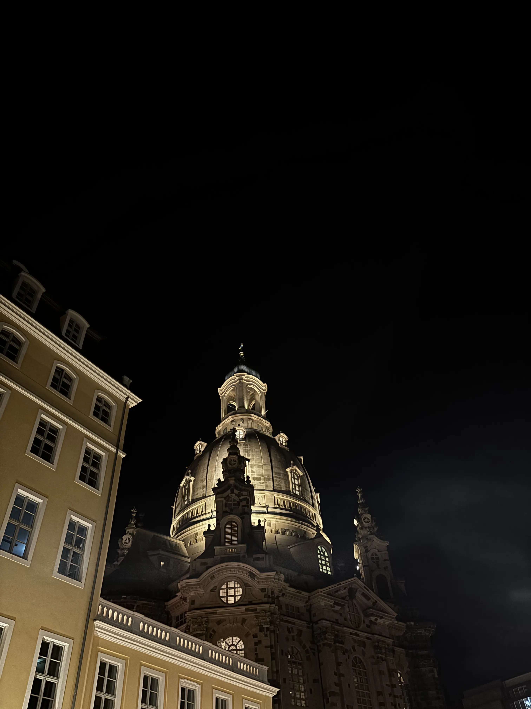
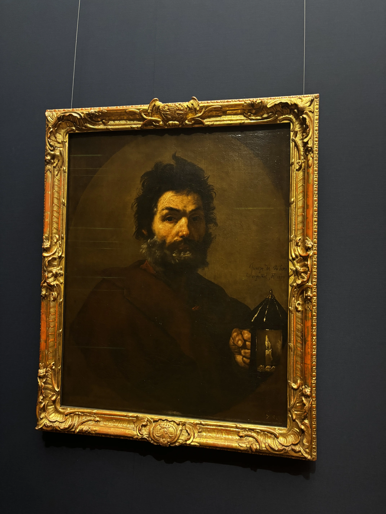
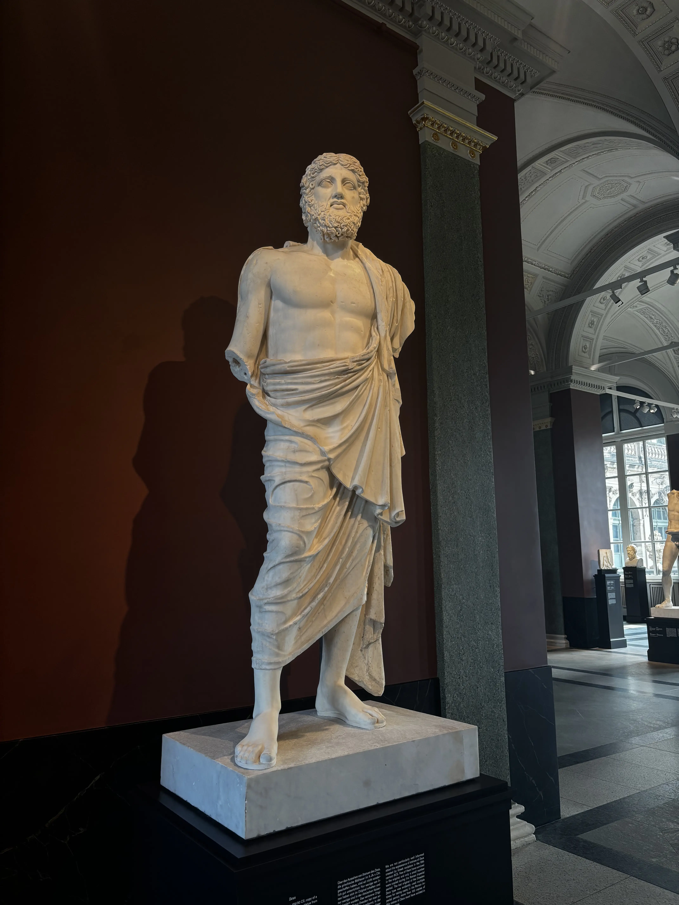

Normally, I'm the guy who spends most of his time at home, debating if leaving the house is worth it. So, yeah... going on a trip feels like a really big deal. Dresden ended up being a mix of wandering, small surprises, quirky encounters, and, of course, beer. Lots of beer.

Don't expect anything serious out of this note — just warning ya 😋

## Grand Garden Palace
The first stop was the Grand Garden Palace and the surrounding park. Gorgeous, obviously. There was a tiny train running through the park — very tempting. Did I ride it? Nope. Couldn't justify being that childish... maybe next time. 🥲

Then came the Polaroid moment (I guess it was a Polaroid?). Some elderly couple handed me their vintage camera and expected me to snap a picture. In my brain, "click = photo" like a modern phone. Reality check: nope. On the actual camera, I had to hold the button. I pressed, let go, nothing. Pressed again, let go... nothing. And each time, they came back to check if the picture was ready. Guy on fifth attempt was like:

Find it humbling? Tell me about it 🫡

Ended the day sitting on a terrace with a view, a drink, and one of those long conversations that make you think about life more than usual. Time away has this weird way of forcing reflection. You start wondering what's happening in your life, where you're heading next, and why you didn't just ride the tiny train. 😔

## Totally unique pathway
Next day: Altstadt. Theaterplatz, Frauenkirche, Dresdener Hofkirche... all those baroque postcards come to life.
|                       |                                         |                                         |
|-----------------------|-----------------------------------------|-----------------------------------------|
|            |  |  |

Naturally, after sightseeing, it was time for the first official ritual of the trip: an Irish pub. And I have to ask — why does every Irish pub always have a TV showing football? Every. Single. One. Is it the sheer number of matches happening? Some kind of Irish pub law? Either way, the atmosphere is unbeatable, so I don't even complain. Cozy, loud, lively... just right.

Yes, that's coca cola. How do you know?

## Katzenpisse
Some days, wandering is the main activity. Somehow stumbled into the [Katzenpisse](https://www.kulturkalender-dresden.de/festival/karierte-katze) Festival just by walking streets I hadn't explored yet. Random, weird, and perfect. That day reinforced something I already suspected: strict plans are overrated, beer is not. Wandering is better, especially when the company is fun. Literally any street, festival, or corner becomes entertaining. People > places. Always.

|       |       |
|-------|-------|
|  |  |

Ah, it also had a good music! How could I possibly forget.. 🙈

## Zoo
Zoo day! Normally, zoos aren't my thing, but Dresden's had penguins. Penguins are objectively adorable. That day produced a ridiculous number of photos — most of which will stay private. Honestly, who even cares?  Anyways, here you go:

|                       |                        |                       |
|-----------------------|------------------------|-----------------------|
|  |  |  |

Walking around exhausted afterward was completely fine, because of course there was a beer at the end of the day. I feel like everyone around might start seeing me as a drunky 🌚 — but I'm really not much of a drinker.

Low-key pa~~ran~~laroid about this fact, low-key fine.

## Sächsische Dampfschifffahrt
And then there was the [Sächsische Dampfschifffahrt](https://www.saechsische-dampfschifffahrt.de/). Watching those boats sail all week and somehow resisting for so long? Impossible. Ticket bought. Main interest: beer on board. Secondary interest: the city view. German cities are funny that way — all gothic/renaissance/baroque vibes, yet somehow still surprising. 

|       |       |       |
|-------|-------|-------|
|  |  |  |

Later, chilling at the flat, I realized again: the ~~people~~ beer you're with matter more than the plan, the sights, or even the perfect sunset.

Did I mention that it was a guided river cruise?

## Dresden at night

Dresden at night deserves a paragraph all to itself. Street artists, statues everywhere, quiet streets that somehow feel cozy and hushed. Walking and talking there... words fail.

Walking past all these statues, I wonder if any of them judged my beer intake. Probably.

I was afraid of statues' judgement, so there are no photos of them in my library whatsoever. So just random pictures and a video:

|       |       |       |       |
|-------|-------|-------|-------|
|  |  |  |  |

## You really need to know
Museums were another story — four hours barely scratched the surface. Add sushi (first in a year!) and, naturally, another beer. Tradition maintained. Integration in Germany done right. ☝️

No more evidence of me drinking, gotta have something to fall back on if needed 🥾🔄

|       |       |       |
|-------|-------|-------|
|  |  |  |

Before leaving, a final couple of beers in a random bar-restaurant. Somehow it became a daily thing. Best way to describe it:

<iframe src="https://www.youtube-nocookie.com/embed/oX1vp-fblx8?si=l3bh4tqDswrGLjJ8&amp;start=27" title="YouTube video player" frameBorder="0" allow="accelerometer; autoplay; clipboard-write; encrypted-media; gyroscope; picture-in-picture; web-share" referrerPolicy="strict-origin-when-cross-origin" allowFullScreen></iframe>

## Something, maybe important
Takeaways? Wander without strict plans. Enjoy the random moments — penguins, festivals, tiny trains, Polaroid fails. Don't be too serious. People matter more than places. And don't. Don't miss on opportunity to board tiny trains if you really want to. I'm telling ya — don't let it derail.

And in Germany, beer is basically a mandatory travel accessory. Honestly, it makes everything better.
