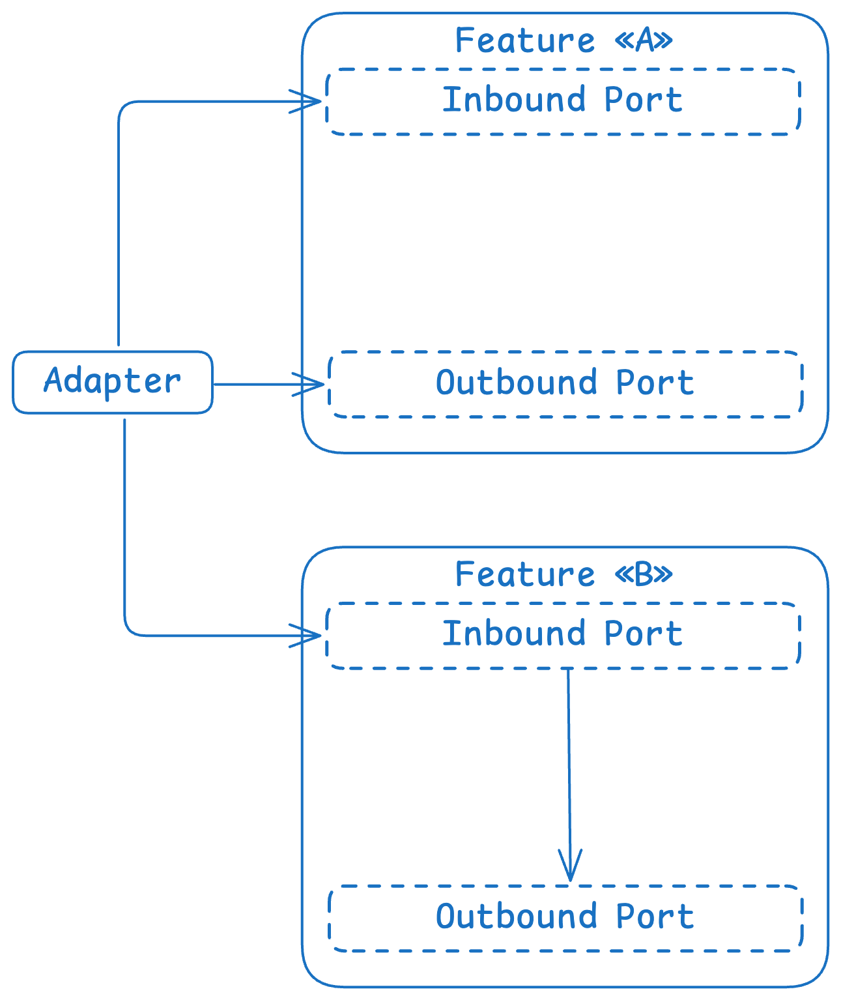

Choosing the right software design is challenging, especially when balancing theory and recommendations from the internet with practical implementation. In this article, I will share my journey and the architectural choices that have worked for me.

Although the title might suggest I'm here to tell you exactly how to structure your application, that's not my goal. Instead, I'll focus on my personal experiences, choices, and the reasoning behind the approaches I've taken when building my apps. This doesn't mean you should structure things the same way, but since many of my friends have asked me about it, I thought I'd try to explain the architecture we use in [Cadento](https://github.com/y9vad9/cadento) (P.S: personal project that I make with my mates; upd: it's almost a 2026 and it's still not finished :D — if it ever is going to be..).

### Smart terminology
You're probably already aware of certain terms like **Clean Architecture**, **DDD** (domain-driven design), or maybe even **Hexagonal Architecture**. Perhaps you've read a lot of articles about it all. But as for me, I saw a few problems in most of them – too much theoretical information and little practical information. They might give you small and non-real examples where everything works perfectly, but it never worked for me and never gave me good answers, only increased boilerplate.

Some of them are almost the same or include each other for the most part and do not conflict with each other in most cases, but many people stop at the specific approach not thinking that it's not the end of the world.

We'll try to learn the most valuable information from different approaches I take inspiration from, apart from how I particularly build my apps at first. Then we'll come to, particularly my thoughts and implementation. Let's start from the same place most people do while developing Android apps:
#### Clean Architecture
Clean architecture sounds pretty simple – you have specific layers that do only a specific job that should be done only at the specific layer (too much specific I know). Google recommends the following structure, though does not name it "clean" but "modern":
- **presentation**
- *domain* (optional in Google's opinion)
- **data**

The **presentation layer** is responsible for your UI, and ideally, its only role is to communicate between the user (who interacts with the UI) and the **domain model**. The **domain layer** handles business logic, while the **data layer** deals with low-level operations like reading and writing to a database.

Sounds simple, right? However, within this structure lies a big question: According to Google's recommended architecture for apps, why is the **domain layer** optional? Where is the business logic supposed to go then?

This idea comes from Google's stance that the domain layer can be skipped in certain cases. In simpler applications, you might find examples where the **business logic** is placed in the **ViewModel** (part of the presentation layer). So, what's the problem with this approach?

The issue lies in the **MVVM/MVI/MVP** patterns and the role of the **presentation layer**. The presentation layer should only handle the **integration with platform details** and UI-related tasks. In this context, it's crucial to keep the presentation layer — whether it's using MVVM or any other pattern — free of **business logic**. The only logic it should contain is related to platform-specific requirements.

Why? In **Clean Architecture**, each layer has a specific responsibility to ensure separation of concerns and maintainable code. The **presentation layer**'s job is to interact with the user through the UI and manage platform-related operations like rendering views or handling input. It's not meant to contain business logic because that belongs to the **domain layer**, where the core rules and decision-making are centralized.

The concept is to separate platform-specific considerations in the presentation layer, making it possible to change or adjust the user interface or platform without impacting the business rules and other code. For instance, if you wanted to transition from an Android to an iOS app, you would only need to rework the UI, while preserving the domain logic, which is particularly beneficial in the context of Kotlin. 😋

Most of the misunderstanding comes from not understanding what business logic is, where it should be located, and the nature of certain examples.

So, to address other issues, let's talk more about the domain layer, specifically about DDD:

### Domain-driven Design
Domain-driven design (DDD) revolves around structuring the application to reflect the core business domain. But simply – what code should be written and in what way?

You surely already know about Repositories or UseCases and some of you might think that UseCases are part of it. But the most important part is not UseCases or Repositories (I overall consider them not a part of a domain), but domain objects around which your domain logic lives.

Domain objects in the DDD realm are essential objects that reflect the business problem you're addressing. They are not just regular DTOs or POJOs as commonly used in many beginner projects. Instead, in DDD, domain objects encapsulate both data and behavior (that includes, for example, validation). They are designed to represent real-world concepts and processes, and they embody the rules and logic that govern those concepts. But what is the simple advice that comes from it?

There are 3 types of domain objects within DDD, so let's talk about them.

#### Value objects
A **value object** is an immutable domain concept that has **no identity** of its own.

It never exists independently — it only makes sense as part of something larger, usually an entity or an aggregate.

Value objects can range from:
- a simple wrapper around a single value
- to a richer structure composed of multiple fields

As long as they are immutable and identity-less, they qualify.

Identity, identity.. but what does it truly mean? In practice, it means that two value objects are considered the same **if their data is the same**. There is no external identifier to compare — only the values they contain.

In Kotlin, this maps naturally to a `data class`, where equality is derived from all properties:
```kotlin
data class Money(
    val amount: BigDecimal,
    val currency: Currency,
) {
	operator fun minus(other: Money) {...}
	// other functionality
}
```
Here, `Money(10, EUR)` is indistinguishable from another `Money(10, EUR)`.

There is no concept of "which one" — only "what value".

Another powerful use of value objects is **semantic typing** — replacing raw primitives with meaningful domain types:
```kotlin
@JvmInline
public value class EmailAddress private constructor(public val rawString: String) {
    public companion object {
        public val LENGTH_RANGE: IntRange = 5..200

        public val EMAIL_PATTERN: Regex = Regex(
            buildString {
                append("[a-zA-Z0-9\\+\\.\\_\\%\\-\\+]{1,256}")
                append("\\@")
                append("[a-zA-Z0-9][a-zA-Z0-9\\-]{0,64}")
                append("(")
                append("\\.")
                append("[a-zA-Z0-9][a-zA-Z0-9\\-]{0,25}")
                append(")+")
            }
        )

		public fun create(value: String): Result<EmailAddress> {
			return when {
				value.size !in LENGTH_RANGE -> Result.failure(...)
				!value.matches(EMAIL_PATTERN) -> Result.failure(...)
				else -> EmailAddress(value)
			}
		}
    }
}
```

You can read more about semantic typing in my article — [Semantic Typing We Ignore](semantic-typing).

In short, my general advice would be to avoid using raw types such as `String`, `Int`, `Long`, etc. directly in your domain model (`Boolean` is often the only reasonable exception).

Instead, introduce semantic value objects that:
- are self-documenting
- encapsulate validation
- localize domain logic
- centralize terminology
- decouple the domain from accidental representations

But what if my business object has a stable identity? That's where domain entities comes into play.

#### Domain entities
A **domain entity** represents a business concept that **has a stable identity over time**.

Unlike value objects, an entity is **not defined by its attributes**, but by _who it is_. Its properties may change, but its identity must remain the same.

An example of it can be, for example, `UserProfile`:
```kotlin
class UserProfile(
    val id: UserProfileId,
    val displayName: DisplayName,
    val email: EmailAddress,
) {
    fun changeDisplayName(
        newDisplayName: DisplayName,
    ): UserProfile =
        UserProfile(
            id = id,
            displayName = newDisplayName,
            email = email,        
        )

    fun changeEmail(
        newEmail: EmailAddress,
    ): UserProfile =
        UserProfile(
            id = id,
            displayName = displayName,
            email = newEmail,
        )
}
```
No matter whether we change the email or the display name, the user is still the same. The identity of the entity does not depend on its attributes — it is anchored in the id, which remains constant even as other properties evolve. This makes it clear that an entity is about _who it is_, not _what it currently has_.

Even though this version of `UserProfile` is immutable, it still preserves its identity through the `id`. Each "change" produces a new instance, representing the same entity at a different point in time. 

In Classic DDD entities are mutable, and many implementations rely on this for convenience. I prefer keeping my code immutable whenever possible, because it makes reasoning about state, testing, and concurrency much safer, while still respecting the core DDD principle that an entity is defined by its stable identity rather than its attributes.

And onto our "composer" — Aggregate.

#### Aggregate
In DDD, an **aggregate** is a cluster of domain objects — usually entities and value objects — that are treated as a single consistency boundary. The aggregate ensures that the rules and invariants of the domain are upheld whenever its internal state changes.

An **invariant** is a business rule that must always hold true for an entity or aggregate. While value objects can enforce rules for their own data (for example, an EmailAddress ensures it has a valid format), an aggregate can enforce **higher-level rules** that involve multiple entities or value objects together. In other words, the data might be valid individually, but not consistent in the context of the aggregate.

```kotlin
class User private constructor(
    val id: UserId,
    val profile: UserProfile,
    val isAdmin: Boolean,
) {

    companion object {
        // enforce invariant at creation
        fun create(
            id: UserId,
            profile: UserProfile,
            isAdmin: Boolean
        ): UserCreationResult {
            if (isAdmin && !profile.email.value.contains("@business_email.com"))
                return UserCreationResult.InvalidAdminEmail

            return UserCreationResult.Success(
                User(id, profile, isAdmin)
            )
        }
    }

    // command within the aggregate
    fun promoteToAdmin(newEmail: EmailAddress? = null): UserPromotionResult {
        val email = newEmail ?: profile.email
        val updatedProfile = profile.changeEmail(email)

        if (!updatedProfile.email.value.contains("@business_email.com"))
            return UserPromotionResult.InvalidAdminEmail

        return UserPromotionResult.Success(
            User(
                id = id,
                profile = updatedProfile,
                isAdmin = true,
            )
        )
    }
}

sealed interface UserCreationResult {
    data class Success(val user: User) : UserCreationResult
    object InvalidAdminEmail : UserCreationResult
}

sealed interface UserPromotionResult {
    data class Success(val user: User) : UserPromotionResult
    object InvalidAdminEmail : UserPromotionResult
}
```

In this example, all creation and state changes go through type-safe factories and commands, ensuring that invariants are never bypassed. It's very important that our domain maintains consistency and data stay valid throughout its entire lifecycle.

The sealed result types make it explicit and self-documentable which outcomes are possible, allowing the compiler to enforce handling of both success and failure cases. Instantiation of `User` directly is prevented by the `private constructor`, so every instance must pass through the validation logic in `create` or `promoteToAdmin`.

Aggregates themselves also have boundaries we need to respect. You can't just embed one aggregate inside another, because each aggregate is responsible for its own invariants and consistency rules. For example, a Team aggregate can't hold User aggregates directly; it only keeps references to their IDs.

```kotlin
class Team private constructor(
    val id: TeamId,
    val name: TeamName,
    val memberIds: Set<UserId> // references to User aggregates by ID
) {
    companion object {
        fun create(
            id: TeamId,
            name: TeamName,
            memberIds: Set<UserId>
        ): Team {
	        // can be more robust validation
            require(memberIds.isNotEmpty()) { "Team must have at least one member" }
            return Team(id, name, memberIds)
        }
    }

    fun addMember(userId: UserId): Team =
        Team(id, name, memberIds + userId)

    fun removeMember(userId: UserId): Team =
        Team(id, name, memberIds - userId)
}
```
This keeps the rules clear: Team enforces its own invariants, while User enforces its own, and they interact safely through IDs rather than mixing their internal states. It's like giving each aggregate its own workspace — they can collaborate, but never step on each other's toes.

__________

Apart from Aggregates, Domain entities and Value objects, sometimes you might see the domain layer's service classes. They're used for the logic that usually cannot be put on the aggregates, but still a kind of business one. For example:
```kotlin
class ShippingService {
	fun calculatePrice(
		order: Order, 
		shippingAddress: ShippingAddress, 
		shippingOption: ShippingOption,
	): Price {
		return if (order.product.country == shippingAddress.country)
			order.price
		else order.price + someFee
	}
}
```

We won't discuss the usefulness or effectiveness of domain-level services or aggregators at this point. Just keep it in mind until we come to the point where we'll combine these approaches into one piece.

But it's pretty much everything – the implementation may vary from project to project, and the only thing I use as a rule for anything – is immutability whenever possible.
#### Problems
##### Anemic Domain Entities
> The **Anemic Domain Model** is a common anti-pattern in Domain-Driven Design (DDD) where the domain objects — entities and value objects — are reduced to passive data containers that lack behavior and only contain getters and setters (if it applies) for their properties. This model is considered "anemic" because it fails to encapsulate the business logic that is supposed to live within the domain itself. Instead, this logic is often pushed into separate service classes, which leads to several problems in the overall design.

To understand this problem more, what particularly is bad about Anemic Domain Entities? Let's review:
- **Possible complexity while understanding what domain entity is capable of**: When logic is spread across controllers or UseCases, it's harder to track the responsibilities of the entity, slowing down understanding and debugging (also, take into account that apart from IDE it's hard to look up the business logic that you put on some kind of controllers or UseCases, it makes code review much harder).
- **Encapsulation is broken**: Entities hold only data without behavior, pushing the business logic into services, making the structure harder to maintain. It means that you should align logic across the UseCases/Controllers/so on and make sure that business logic is actually changed to the right one.
- **Harder to test**: When behavior is scattered, testing individual features gets harder because logic isn't grouped inside the entity itself.
- **Repetition of logic**: Business rules often get repeated across services/usecases, leading to unnecessary repetition and higher maintenance costs.

An example of a bad business entity:

```kotlin
sealed interface TimerState : State<TimerEvent> {
    override val alive: Duration
    override val publishTime: UnixTime

    data class Paused(
        override val publishTime: UnixTime,
        override val alive: Duration = 15.minutes,
    ) : TimerState {
        override val key: State.Key<*> get() = Key

        companion object Key : State.Key<Paused>
    }

    data class ConfirmationWaiting(
        override val publishTime: UnixTime,
        override val alive: Duration,
    ) : TimerState {
        override val key: State.Key<*> get() = Key

        companion object Key : State.Key<ConfirmationWaiting>
    }

    data class Inactive(
        override val publishTime: UnixTime,
    ) : TimerState {
        override val alive: Duration = Duration.INFINITE

        override val key: State.Key<*> get() = Key

        companion object Key : State.Key<Inactive>
    }

    data class Running(
        override val publishTime: UnixTime,
        override val alive: Duration,
    ) : TimerState {
        override val key: State.Key<*> get() = Key

        companion object Key : State.Key<Running>
    }
    
    data class Rest(
        override val publishTime: UnixTime,
        override val alive: Duration,
    ) : TimerState {
        override val key: State.Key<*> get() = Key

        companion object Key : State.Key<Rest>
    }
}
```
These are simply containers with data about Cadento states. The question is: how can we transform this anemic domain entity into a rich one?

In this case, for states, I had a different controller that was handling all transitions and events:
```kotlin
class TimersStateMachine(
    timers: TimersRepository,
    sessions: TimerSessionRepository,
    storage: StateStorage<TimerId, TimerState, TimerEvent>,
    timeProvider: TimeProvider,
    coroutineScope: CoroutineScope,
) : StateMachine<TimerId, TimerEvent, TimerState> by stateMachineController({
    initial { TimerState.Inactive(timeProvider.provide()) }

    state(TimerState.Inactive, TimerState.Paused, TimerState.Rest) {
        onEvent { timerId, state, event ->
            // ...
        }
		
		onTimeout { timerId, state ->
			// ...
		}
	// ...
}
```
Besides its good look, it violates the DDD principles – domain object should represent not only data but also behavior. The entity should be like this:
```kotlin
sealed interface TimerState : State<TimerEvent> {
    override val alive: Duration
    override val publishTime: UnixTime

	// Now business entity can react to events by itself;
	// This functions are 'aggregates' from DDD;
	fun onEvent(event: TimerEvent, settings: TimerSettings): TimerState
	fun onTimeout(
		settings: TimerSettings, 
		currentTime: UnixTime,
	): TimerState

    data class Paused(
        override val publishTime: UnixTime,
        override val alive: Duration = 15.minutes,
    ) : TimerState {
        override val key: State.Key<*> get() = Key

        companion object Key : State.Key<Paused>

		override fun onEvent(
			event: TimerEvent, 
			settings: TimerSettings,
		): TimerState {
			return when (event) {
		    	TimerEvent.Start -> if (settings.isConfirmationRequired) {
		       		TimerState.ConfirmationWaiting(publishTime, 30.seconds)
		    	} else {
		        	TimerState.Running(publishTime, settings.workTime)
		        }
        
		        else -> this
		    }
		}

		override fun onTimeout(
			settings: TimerSettings, 
			currentTime: UnixTime,
		): TimerState {
			return Inactive(currentTime)
		}
    }

    // ...
}
```

> **Note**: Sometimes some logic is put into UseCases and it might be less obvious than in this particular case.

By looking at such an entity you understand faster what it does, how it reacts to the domain events, and other things that may happen.

But, as for business objects, sometimes you may feel that it does not have any behavior that you may add/move to them. Here's my example of such an object:

```kotlin
data class User(
    val id: UserId,
    val name: UserName,
    val emailAddress: EmailAddress?,
    val description: UserDescription?,
    val avatar: Avatar?,
) {
    data class Patch(
        val name: UserName? = null,
        val description: UserDescription? = null,
        val avatar: Avatar?,
    )
}
```
> **Interesting note**: It's an actual code from my user's domain with such a problem. 

The potential problem is that `User` and `Patch` are data containers without business logic. First of all, I use `Patch` only at the UseCases, which means that it should be put where it's needed. Use this rule for everything – declaration without usage on the layer which defines it, means that you do something wrong.

As for `User`, there's no need to create aggregate functions – Kotlin's auto-generated copy method is more than enough as value-objects are already validated and there's no custom logic for that for the entire entity.

To learn more about this problem, you may reference, for example, this [article](https://medium.com/@inzuael/anemic-domain-model-vs-rich-domain-model-78752b46098f).

I'd add that you should try to avoid anemic domain entities, but at the same time do not force yourself to – if there is nothing to aggregate, do not add aggregates. Don't invent a behavior if there's nothing to be added – [KISS](https://www.interaction-design.org/literature/topics/keep-it-simple-stupid) still applies.

##### Ignoring Ubiquitous Language
Ubiquitous Language, a key concept in DDD, is often ignored. The domain model and code should use the same language as the business stakeholders to reduce misunderstandings. Failing to align the code with the **language of the domain experts** results in a disconnect between the business logic and the actual implementation.

In simple terms, names should be easy to understand even for non-programmers. This is especially helpful for large projects involving multiple teams with varying knowledge, skills, and responsibilities.

That's something small to follow, but very important. I'd add that the same concepts shouldn't have different names across different domains – it's confusing even within one team.

_________
Now, let's move on to another approach I'm using in my projects – Hexagonal Architecture:
### Hexagonal Architecture
Hexagonal Architecture, also known as Ports and Adapters, takes a different angle on structuring applications compared to traditional approaches. It's all about isolating the **core domain logic** from external systems — so that the core business logic isn't dependent on frameworks, databases, or other infrastructure concerns. This approach promotes **testability** and **maintainability**, and it aligns well with **DDD** in that the focus remains on the business logic.

> There're two types of **Ports** – Inbound and Outbound.
>
> 1. **Inbound ports** are about defining the operations that the outside world can perform on the core domain.
> 2. **Outbound ports** are about defining the services that the domain needs from the outside world.

The difference between DDD and Hexagonal architecture in isolation strategy is conceptually the same, but the second one takes it to the next level. Hexagonal Architecture defines how you should communicate with your domain model.

So, for example, if you need to access an external service or feature to do something in your domain, you do the following:
```kotlin
interface GetCurrentUserPort {
	suspend fun execute(): Result<User>
}

class TransferMoneyUseCase(
	private val balanceRepository: BalanceRepository,
	private val getCurrentUser: GetCurrentUserPort
) {
	suspend fun execute(): ... {
		val currentUser = getCurrentUser.execute()
		val availableAmount = balanceRepository.getCurrentBalance(user.id)
		// ... transfer logic
	}
	
	// ...
}
```

> **UseCases** are typically considered inbound ports since they represent operations or interactions initiated by the external world. However, the naming and implementation may vary.

In my projects, I prefer not to introduce another terminology and usually I just create an interface of Repository that I need from outside:
```kotlin
interface UserRepository {
	suspend fun getCurrentUser(): Result<User>
	// ... other methods
}
```
I consolidate everything into a single repository to avoid unnecessary class creation, providing a clearer abstraction for most people familiar with the concept of a repository.

It may not always be the case that you need to call a repository from another feature or system. Sometimes, you may want to call a different business logic that handles what you need (what can be much better), known as UseCases. In this scenario, it's common to have a distinct interface from the first example.

Here's the visualization:


> **Note**: By the way, the other terminology for 'feature' is the ['bounded context'](https://martinfowler.com/bliki/BoundedContext.html) from the DDD. They pretty much mean the same.

The example of defining and using ports that follows the schema above:
```kotlin
// FEATURE «A»

// Outbound port to get the user from another feature (bounded context)
interface GetUserPort {
    fun getUserById(userId: UserId): User
}

class TransferMoneyUseCase(private val getUserPort: GetUserPort) : TransferService {
    override suspend fun transfer(
	    val userId: UserId, val amount: USDAmount
    ): Boolean {
        val user = getUserPort.getUserById(request.userId)
        if (user.balance >= request.amount) {
            println("Transferring ${request.amount} to ${user.name}")
            return true
        }
        println("Insufficient balance for ${user.name}")
        return false
    }
}
```

Implementation of ports is done through _Adapters_ – they're basically just linkage that implements your interface to work with an external system. The naming of such layer may vary – from simple **data** or **integration** to straightforward **adapters**. They are pretty interchangeable and up to specific project naming conventions. This layer usually implements other domains and uses other _Ports_ to achieve what it needs. 

Here's example of `GetUserPort` implementation:
```kotlin
// UserService is the Service from another feature (B)
// Adapters are usually in separate module because they're dependent on
// another domain, to avoid straight coupling.
class GetUserAdapter(private val getUserUseCase: GetUserUseCase) : GetUserPort {
    override fun getUserById(userId: String): User? {
        return userService.findUserById(userId)
    }
}
```

So, features are only coupled at the data/adapters level. The advantage of it is that your domain logic remains unchanged no matter what happens to the external system. That's another reason why the domain's ports actually shouldn't comply with everything that the external system wants – it's the Adapter's responsibility to deal with it. By that, I mean that, for example, the function signature might be different from the one that is used in the external system as long as it makes it possible to play around, of course.

Another thing is that it's important to consider how to handle domain types. Features are rarely completely isolated from other types of features. For instance, if we have a business object called `User` and a value object `UserId`, we often need to reuse the user's ID to store information related to the user. This creates a need to find a way to reuse this type in different parts of the system.

In an ideal Hexagonal architecture, different domains should exist independently. This means that each domain should have its specific definitions of the types they use. In simpler terms, it requires you to redeclare these types every time you need them.

It creates a lot of duplication, boilerplate while converting each type between separate domains, problems with validation (especially if requirements change over time, you might overlook something), and just a great pain in any developer's life. 

The advice is that you shouldn't follow all of those rules as long as you don't see the benefit. Look for a happy medium while dealing with it, how I dealt with that we will discuss in the following part.

#### Problems
##### Incorrect mental model
As for mistakes I see the most – developers don't understand that the Domain & Application layers is not just about a physical division, but about the correct mental model. Let me explain:

> **Mental model** is a conceptual representation of the work or structure of various parts of the system that interact with each other (simply, how the code is perceived by those who use it). It differs from a physical model in that a physical model involves **physical** interaction - for example, calling a specific function or implementing a module, i.e. anything that is done by hand.

A common issue in software design is allowing the domain/application layer to be aware of data storage or sourcing, which violates the separation of concerns principle. The domain's focus should remain on business logic, independent of data sources. However, you might encounter examples like `LocalUsersRepository` or `RemoteUsersRepository`, and corresponding use cases such as `GetCachedUserUseCase` or `GetRemoteUserUseCase` in application layer (in case if repositories put in domain, I usually put them in place where I use them — in application layer, but problem remains). While this may solve a specific problem, it violates the domain's mental model, which should remain agnostic to the source of the data.

The same applies to the DAOs in the context of frameworks like `androidx.room`. They're not only violating the rule of saying about the data source, but in addition, violate the rule of independence of any frameworks.

Your repositories/usecases should stay away from the source of data, even though it might seem to be okay in situations when implementation is not directly in the domain/application layer.

### My implementation
After finishing the explanation of the approaches that I use, I'd like to proceed to my actual implementation and how I dealt with reducing unnecessary boilerplate and abstractions.

Let's start by defining the key ideas of each approach we discussed:
- **Clean Architecture**: divide your code into different layers by their responsibility (domain, data, presentation)
- **Domain-driven Design**: The domain should contain only a business logic, all types should be consistent and valid across all of its lifecycle.
- **Hexagonal Architecture**: Strict rules about accessing inside and outside worlds. 

They perfectly match each other for the most part, which makes it a key to writing good code.

The structure of Cadento features (different domains) is following:
- **domain**
- **data** (Implements everything that is related to storage or network management, including submodules with DataSources)
	- **database** (integration with SQLDelight, auto-generated DataSources)
	- **network** (actually, I don't have it in Cadento, because it's replaced with [Cadento SDK](https://github.com/timemates/sdk), but if it is not, I would add it)
- **dependencies** (Integration layer with Koin)
- **presentation** (UI with Compose and MVI)

I like this structure so far, but you might want to distinguish the UI from ViewModels to be able to use different UI frameworks per platform, I am not planning to, so I leave it as it is. But if I face such a challenge in the future, it's not hard for me as I am not dependent on the Compose in the ViewModels.

The main problem I experienced was the boilerplate that I had while implementing Hexagonal Architecture – I copied and pasted types that made me wonder 'Do I need it much'? So, I came up with the following rules:
1. I have common core types that are reused among different systems, it's a kind of combined domain of most needed types.
2. The type can be only common if it's used among most of the domains, has a problem with duplication of the validation, and is not a complex structure (sometimes there are exceptions, but usually there are not a lot) at all.

What do I mean by 'complex structure'? Usually, your domain that demands another domain's type, doesn't need everything that's described in the given type. For example, you might want to share the 'User' type, among its value objects, but for the most part, other domains do not need all from the User type and might want, for example, only the name and the ID. I am trying to avoid such situations and even if something is already in the core domain types, I would rather create a distinct type with information that my certain domain needs. But, regarding validation, I share almost all value objects. 

You may extend this idea for bigger projects by creating not just common core types, but types for specific areas where some group of your subdomains (bounded contexts) works.

To sum up, I am reusing value objects that have the same validation rules in one common module; I am trying not to make my common core types module too big with everything. There should always be a happy medium. 

In addition, in my projects, I don't have 'Inbound Ports' as a term in my projects. I replace them fully with UseCases:

What do I mean under 'complex structure'? Usually, your domain that demands another domain's type, don't actually need everything that's described in the given type. For example, you might want to share 'User' type, among with its value objects, but for the most part, other domains do not need all from User type and might want, for example, only name and the id. I am trying to avoid such situations and even if something is already in the core domain types, I would rather create distinct type with information that my certain domain need. But as for validation, I share almost all semantic value objects. 

You may extend this idea for bigger projects by creating not just common core types, but types for specific areas where some group of your subdomains (bounded contexts) works.

To sum up, I am reusing value objects that have the same validation rules in one common module; I am trying not to make my common core types module too big with everything. There should be always a happy medium. 

In addition, in my projects I don't have 'Inbound Ports' as term in my projects. I replace them fully with UseCases:
```kotlin
class GetTimersUseCase(
    private val timers: TimersRepository,
    private val fsm: TimersStateMachine,
) {
    suspend fun execute(
        auth: Authorized<TimersScope.Read>,
        pageToken: PageToken?,
        pageSize: PageSize,
    ): Result {
        val infos = timers.getTimersInformation(
            auth.userId, pageToken, pageSize,
        )

        val ids = infos.map(TimersRepository.TimerInformation::id)
        val states = ids.map { id -> fsm.getCurrentState(id) }

        return Result.Success(
            infos.mapIndexed { index, information ->
                information.toTimer(
                    states.value[index]
                )
            },
        )
    }

    sealed interface Result {
        data class Success(
            val page: Page<Timer>,
        ) : Result
    }
}
```
> **Note**: it's an example from the Cadento Backend

It does not violate Hexagonal Architecture or DDD which makes it a good way to define how the external world accesses your domain. It has the same meaning and behavior as an inbound port.

As for outbound ports, I made the same as I provided earlier in examples.

## Conclusion
In my projects, I prefer to keep things practical. While theory and abstraction are useful, they can overcomplicate simple things. That's why I combine the strengths of Clean Architecture, DDD, and Hexagonal Architecture without being overly strict about following them to the letter. Use critical thinking to determine what you actually need and why it benefits your project, rather than blindly following recommendations.
