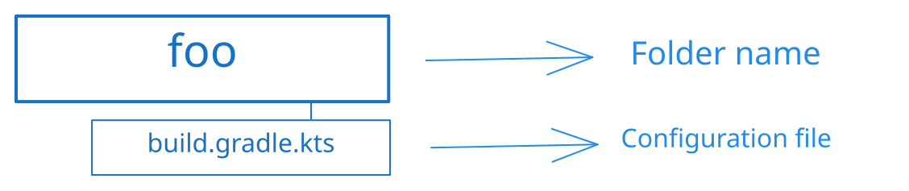
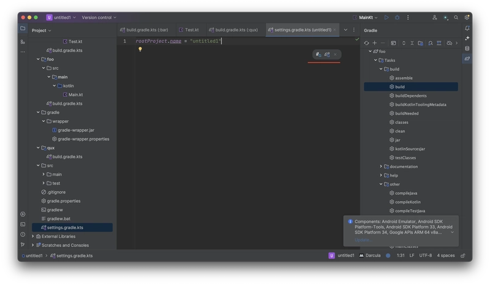

When developing on Kotlin, every beginner faces the problem of not understanding the appropriate tooling for working with the programming language. That's what this article was created for - to explain the work of Gradle for Kotlin and on Kotlin. Let's go!

> ❓ **Definition** <br/>
> **Gradle** is a system for automating the assembly, including building and compilation. It's designed for complex build flows, where the task is not only to execute the code, but to create custom build logic, handle multi-module projects, and integrate with continuous integration systems.

But let's start with something simple - how to create our first project using Gradle?

## Project
Let's start with the basic concept that exists in the application building system - Project.

### Definitions

> **Project** is an independent unit of application organization as a set of dependent modules and rules for them.

> **Module** is an independent unit of code organization that has a certain set of rules (how it is built, etc.). Exists for the same purpose as packages in Kotlin — to divide the code into logical blocks in order to improve the quality of the source code (reuse of code, both in one project and in others).

What rules am I talking about? In fact, everything is very simple - we describe how our project will be built (description of technical features), for which platform (for example, Android or iOS), in which language, and with which means (project dependencies).

### Structure
Let's create an example project structure:

> P.S: The names in the example have no special sense, they're just terminology from [Foobar](https://wikipedia.org/wiki/Foobar).


All modules are required to have `build.gradle.kts` in order to work. It's important to note that modules cannot exist on their own and they only work if we include them to our project explicitly via `settings.gradle.kts`

As you can see, we have a kind of "chief supervisor", who determines which modules will be in our project and how they will work, and "local supervisors" who set rules only for the code subordinate to them (modules), but, it's worth noting that **Project** has more priority than modules when it comes to rules (but it isn't something that we will cover in this particular article).

What rules are there? In fact, there are many of them - it all depends on what you do, but the basic ones are, for example:
- Project name, version, group (an identifier that is a kinda package from Kotlin)
- Programming language (Java / Scala / Groovy / Kotlin / etc)
- Platform (Only relevant for Kotlin, to be more clear, for Kotlin Multiplatform plugin)
- Dependencies (libraries or frameworks used in the code)

## Modules
Let's consider the modules: how and with what they are eaten. Let me remind you what a module is:
> ❓ **Definition** <br/>
> **Module** is an independent unit of code organization that has a certain set of formal rules that define the module's behavior.

For an example, let's take `foo` module:

To create a module, first of all, we create the directories of this module. After that, we create a file with the name `build.gradle.kts` (or `build.gradle` if you use Groovy as script language, no other way), where we will already prescribe what our module can do.
### `build.gradle.kts`
Our settings file has the following structure:

Don't be afraid! Even if it looks quite complicated. 😄

The main component in any `build.gradle.kts` is the **Plugins** block. **Dependencies** and **Repositories** blocks are independent of Plugins block, but without it, they're like comedians telling jokes in an empty theater – they may have some great material, but there's no stage, no audience, and no laughter to be heard.

Plugins that are applied to your module usually consume what you've specified in the **Dependencies** block. So, dependencies without plugins that will use it are useless, that's why dependencies has a connection with plugins in our scheme.

**Repositories** are not dependent on plugins per se, but you always need them in place to apply any dependencies or plugins to your project. Therefore, without plugins or dependencies, it makes no sense to exist. So, using our previous analogy, it's akin to having a theater full of people without any comedians on stage.

**Tasks** are also a fundamental thing in your Gradle configuration files. They're always provided by plugins that you're applying to your module. In an empty module without any plugin, you will not have any tasks. However, there are some basic tasks that are available on a project level: 
- `tasks` (returns list of available tasks across the project: name, on which tasks task is dependent, etc.).
- `dependencies` (prints a report of the project's dependencies, showing which dependencies are used and their versions)
- `help` (returns list of available tasks across the project with a brief description).
- `model` (provides a detailed report of your project's structure, tasks, etc.; helping you understand and debug your Gradle build)
- etc.

> **💡 Bonus** <br/>
> Tasks can be dependent on other tasks, it's especially useful when you're needed in the result of other task's execution.

#### Example
Now, let's consider an example. For instance, let's create a Kotlin/JVM project with [kotlinx.coroutines](https://github.com/Kotlin/kotlinx.coroutines) library as a dependency.

Firstly, we need to create our project configuration file – `settings.gradle.kts` in the root of our project:
```kotlin
rootProject.name = "our-first-project"
```

To make it work, you should run gradle sync inside your IDE:



You can either create a new folder for a new module or utilize the root folder as a module in the same way by simply adding a `build.gradle.kts` file in the root directory (`our-first-project/build.gradle.kts`).

> ❗️ **Important** <br/>
> When we use root folder as a module we don't need to explicitly add it to our project configuration file, but for any new modules we should declare it by using the `include` function – for example, `include(":foo")` (for nested folders use `include(":foo:bar")`)

Let's start with `plugins`:
```kotlin
plugins {
	id("org.jetbrains.kotlin.jvm") version "1.9.0"
}
```

> **💡 Bonus** <br/>
> We can simplify the declaration of Kotlin plugins (such as `jvm`, `android`, `js`, `multiplatform`) using `kotlin` function: `id("org.jetbrains.kotlin.jvm")` -> `kotlin("jvm")`.
> It automatically appends `org.jetbrains.kotlin` at the start.

Now, let's come to the Dependencies:
```kotlin
dependencies {
	implementation("org.jetbrains.kotlinx:kotlinx-coroutines-core:1.7.3")
}
```

Our Kotlin/JVM plugin provides a useful for us function – `implementation`. Without it, we would have to write explicitly a configuration name (identifier for plugin) that will consume our dependencies. As you can remember, dependencies do not live on their own. So, to be more clear, **Dependencies** block provides only the basic ability to add and consume added dependencies. We could add our dependency in the next way (but we still need a plugin that will consume it):
```kotlin
dependencies {
	add(configurationName = "implementation", "org.jetbrains.kotlinx:kotlinx-coroutines-core:1.7.3")
}
```

> **configurationName** stands for dividing dependencies with different target plugins (plugins that are consuming our dependencies).

But, if we try to build our module, we will have the next problem:
```text
Could not resolve all dependencies for configuration ':compileClasspath'. > Could not find org.jetbrains.kotlinx:kotlinx-coroutines-core:1.7.3.
```
To resolve this issue, we need to specify the repository from which we want to implement our dependency. Let's look at the example:
```kotlin
repositories {
	// builtins:
	mavenCentral()
	mavenLocal()
	google()
	
	// or specify exact link to repository:
	maven("https://maven.y9vad9.com")
}
```

> ❓ **Definition** <br/>
> <u>Maven repositories</u> – are like online stores or libraries for code. They are collections of pre-built software libraries and dependencies that you can easily access and use in your projects. These repositories provide a centralized and organized way to share and distribute code.
>
> Also, it's important to notice, that Maven is _another build tool_ with built-in support from Gradle.

But, for our case, we're only needed in `mavenCentral()`. So, our resulting `build.gradle.kts` is next:
```kotlin
plugins {
	kotlin("jvm") version "1.9.0"
}

repositories {
	mavenCentral()
}

dependencies {
	implementation("org.jetbrains.kotlinx:kotlinx-coroutines-core:1.7.3")
}
```

For such an example, we don't need to touch any tasks. But it would be good to mention that our Kotlin plugin provides the following tasks:
- `compileKotlin`
- `compileJava`
- etc

But, usually, you don't need to call these tasks directly, unless you're developing your own plugin that is dependent on results/outputs from these tasks.

> 💡 **Bonus** <br/>
> You can run gradle tasks either by using command line or through IDE:
>
> As an example I took `gradle build` task.

We will skip for now a full explanation of tasks and how they can be used. I will cover it in the next articles.

Now, let's finally come to how and where can we write our code.

### Source sets
We figured out how to create a project and modules, but where should we write the code? In Gradle projects, there is a concept of different sets of source code (Source sets) - a kind of separation of code for different needs. For example, the following sets exist by default for our previous example:
- `main` – The name says ifself, it's main place where code should be placed.
- `test` – Used for code that are related to testing. It's dependent on `main` source set and has all dependencies / code you have written in `main`.


> 💡 **Bonus** <br/>
> But it's not always the case, for instance, [Kotlin/Multiplatform projects](https://kotlinlang.org/docs/multiplatform.html) have dedicated source sets for every platform you're writing for (basically, the plugin creates a set of source sets for all the platforms we need). So, it's important to mention that it always depends on the plugins you're applying to the module and on your configuration. It's not a constant.

#### main

To start coding we need to create a folder for our programming language, for Kotlin it's `src/main/kotlin` folder. So, from now on, we can simply create our 'Hello, World!' project. Let's create `Main.kt` in our recently created folder:
```kotlin
fun main() = println("Hello, Kotlin!")
```
You can run it using IDE, it will automatically handle the Gradle Building process.

#### test
As I've previously told you, this source set is used for testing purposes. But it's important to mention that it has its own dependencies (but it also forks it from `main` source-set). So, you can implement dependencies that will be available in this source-set. For example, let's implement `kotlin.test` library:
```kotlin
dependencies {
	// ...
	testImplementation(kotlin("test"))
}
```

You can refer to [full tutorial](https://kotlinlang.org/docs/jvm-test-using-junit.html) in Kotlin documentation of how you can test your code using `kotlin.test`.

## Multi-module projects
The creation of different modules creates the need for their interaction with each other. Also, let's analyze the types of interaction, how you can't or shouldn't do it, and what's the point. Let's start!

If you remember our [initial project structure](#Structure) it has a few modules:
- `foo`
- `bar`
- `qux`

Let's consider `foo` as the main module where we have our entry point to application (`Main.kt` file). Let's begin with creating a configuration for all three modules (it will be simple without any dependencies):
```kotlin
plugins {
	kotlin("jvm") version ("1.9.0")
}

repositories {
	mavenCentral()
}
```

To make it work, let's add our modules to `settings.gradle.kts`:
```kotlin
rootProject.name = "example"

include(":foo", ":bar", ":qux")
```

Then, let's make `foo` dependent on `bar` module:
```kotlin
// File: /foo/build.gradle.kts

dependencies {
	implementation(project(":bar"))
}
```

> ❗️ **Important** <br/>
> To implement a module from your project, you should specify it using `project` function. When implementing modules or specifying it somewhere else, we use special notation where `/` is replaced with the `:` symbol.
> 
> And bonus: to implement the root module, just use `implementation(project(":"))`.

From now, we can use any function or class from the `bar` inside the `foo` module (of course, if the visibility of these declarations allows it). For example, let's create a file in `foo` module:
```kotlin
package com.my.project

fun printMeow() = println("Meow!")
```

And we can use it in `foo` module:
```kotlin
import com.my.project.printMeow

fun main() = printMeow()
```

But, can't use it from `qux` module. Moreover, if we try to implement `foo` module, `bar` will still stay inaccessible. Module's dependencies are not exposed to other modules by default.

> 💡 **Bonus** <br />
> We can share dependencies for modules that implement our particular module using [`api`](https://docs.gradle.org/current/userguide/java_library_plugin.html#sec:java_library_separation) function instead of `implementation`. In this way, for example, `qux` module can access `bar` module functions/classes/etc by implementing `foo` without explicit dependence on the `bar` module.

### Limitations
Imagine that after the previous example, you need to get any class/function/etc. inside `bar` from `foo` module. If you will try to do this, you will have the next problem:
```
Circular dependency between the following tasks:
:bar:classes
\--- :bar:compileJava
     +--- :bar:compileKotlin
     |    \--- :foo:jar
     |         +--- :foo:classes
     |         |    \--- :foo:compileJava
     |         |         +--- :bar:jar
     |         |         |    +--- :bar:classes (*)
     |         |         |    +--- :bar:compileJava (*)
     |         |         |    \--- :bar:compileKotlin (*)
     |         |         \--- :foo:compileKotlin
     |         |              \--- :bar:jar (*)
     |         +--- :foo:compileJava (*)
     |         \--- :foo:compileKotlin (*)
     \--- :foo:jar (*)
```
What is it all about? Everything is simple – you cannot create circular dependencies. 

Circular dependencies in Gradle are like a never-ending loop that makes your build process stuck because tasks keep waiting for each other to finish, which never happens. It's essential to avoid them to ensure your build runs smoothly. Furthermore, it's always about violating [**Dependency Inversion Principle**](https://en.wikipedia.org/wiki/Dependency_inversion_principle) that is not good practice.

You can refer to [this discussion](https://discuss.gradle.org/t/gradle-support-for-cyclic-dependencies/14355) to read about it more.

> 👨🏻‍🏫 **Bonus for experienced** <br />
> Usually, if we talk about, for example, mobile applications, we use Three-Tier Architecture. So, it's a good idea to divide it into different modules to enforce architectural rules:
> 
> It makes, for example, our `domain` layer not to be dependent on `data` layer – it's literally impossible as there will be a circular dependency problem.

## Conclusion
It's not just another coffee brewing method; it's a powerful build automation tool that simplifies your software development process. With Gradle, you can manage dependencies, automate tasks, and keep your projects well-organized. It's like having a trusty assistant who takes care of the nitty-gritty, so you can focus on writing awesome code!
