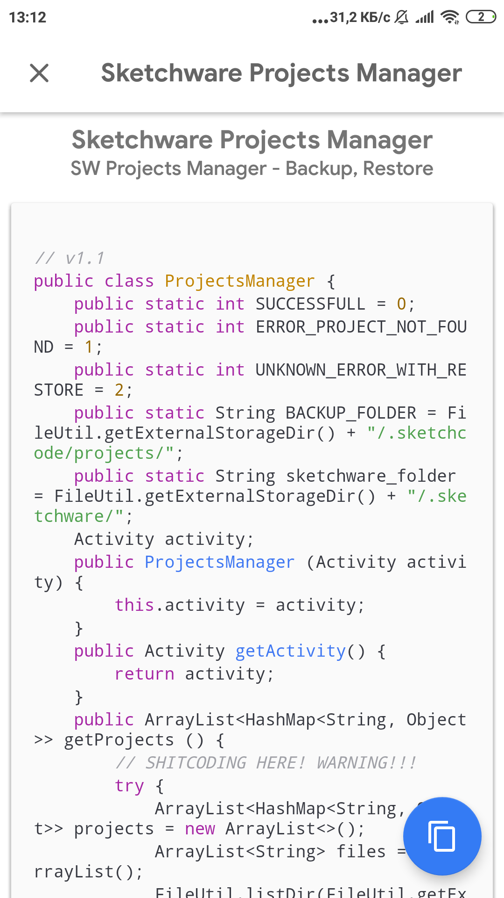
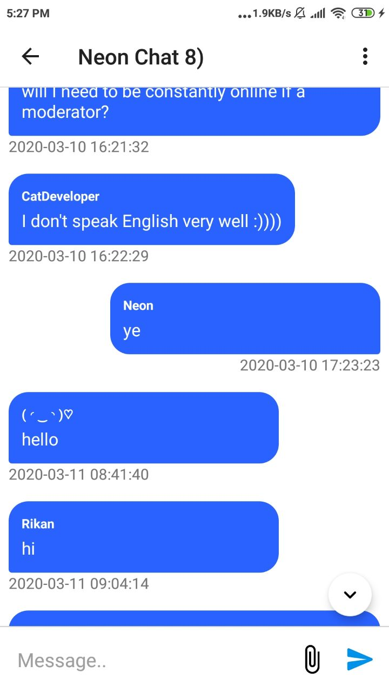

> In 2018, I created Sketchcode, a social network for developers using [Sketchware](https://sketchware-docs.vercel.app/) – a no-code Android app builder. It
> wasn't just about sharing projects; it became a hub for tutorials, UI components, and collaboration. At its peak,
> Sketchcode supported 3,000 active users on a shoestring budget. Running it taught me more than just coding — it taught
> me resilience and resourcefulness.

## Screenshots
|  |  |  |
| --- | --- | --- |
|  |  |  |
|  |  |  |
|  |  |  |
> Note: Unfortunately, I don't have much screenshots (including how app changed), so I provide the only those
> I found out.

## History

Sketchcode was my first project — an app for [Sketchware](https://sketchware-docs.vercel.app/), originally built *in* Sketchware. It outgrew what no-code could do pretty quickly, so I moved it to Android Studio and Java. That's how I started programming.

### First major version (global feed and custom blocks)

The first release had three things:

- A global feed for sharing and discovering content.
- Custom blocks users could drop into their own projects.
- Code snippets, so more advanced users could insert raw Java through a dedicated block.

### Second major version (community and tutorials)

This one opened things up so people could share their own stuff:

- Sharing for custom blocks and snippets.
- A tutorials section, with the first guides written by me.
- A UI builder so users could write and publish their own tutorials.

> Note: I don't have screenshots from this version, apart from the one below.

### Third major version (projects and private backups)

- Users could share their posts and full Sketchware projects.
- Private projects, for anyone who just wanted a backup.

### Fourth version (new UI and social features)

- A redesigned UI.
- Comments, likes and other social features in the Projects Market.

Hosting the projects feature was the hard part. Over 60GB of server storage, no monetization, free for everyone — I spent a lot of time reorganizing file structures and compressing uploads to keep it affordable.

### Peak

At its peak Sketchcode had 3,000 — 4,000 users and over 10 million requests a month. I worked on it through a lot of nights.

### Last major feature (chat)

A simple chat with image and sticker support, so people could talk to each other directly in the app. You can find how it looked like above in the image carousel.

### Looking back

Sketchcode is where I learned to program. It went from something I built inside a no-code app to a platform people actually relied on, and most of what I know now started there.
