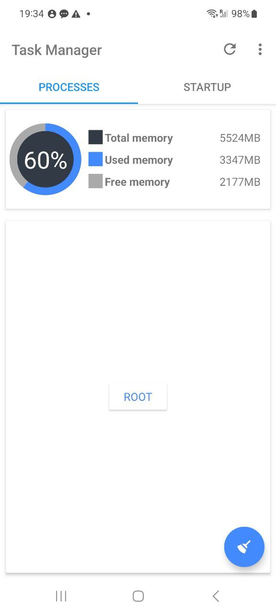

> Task Manager was a mobile application designed to help users manage their device's startup applications, active
> processes, and RAM usage. With its user-friendly interface and powerful functionality, it provided users with an
> efficient way to optimize their device's performance.

## Features

- **Startup Application Management**: Enable or disable applications that start when the phone boots.
- **Process Management**: View and terminate running processes to free up system resources.
- **RAM Cleaning**: Optimize memory usage for better performance.
- **User-Friendly Interface**: Simple and intuitive UI for easy navigation.

## Achievements

- **70,000+ Downloads**: The app was downloaded more than 70K times.
- **7,000 Monthly Active Users**: At its peak, the application had 7K active users per month.

## Screenshots

|                                                                                     |                                                                                 |                                                                                            |
|-------------------------------------------------------------------------------------|---------------------------------------------------------------------------------|--------------------------------------------------------------------------------------------|
|  |  |  |

## Conclusion

Task Manager was a widely used tool for mobile optimization, helping users keep their devices running smoothly. While
the project is no longer active, its impact and success remain notable.
