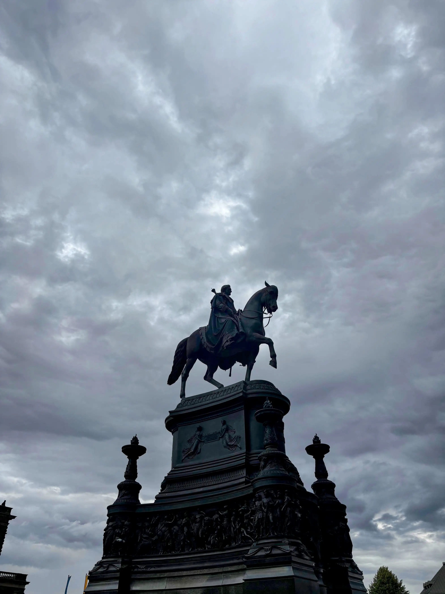
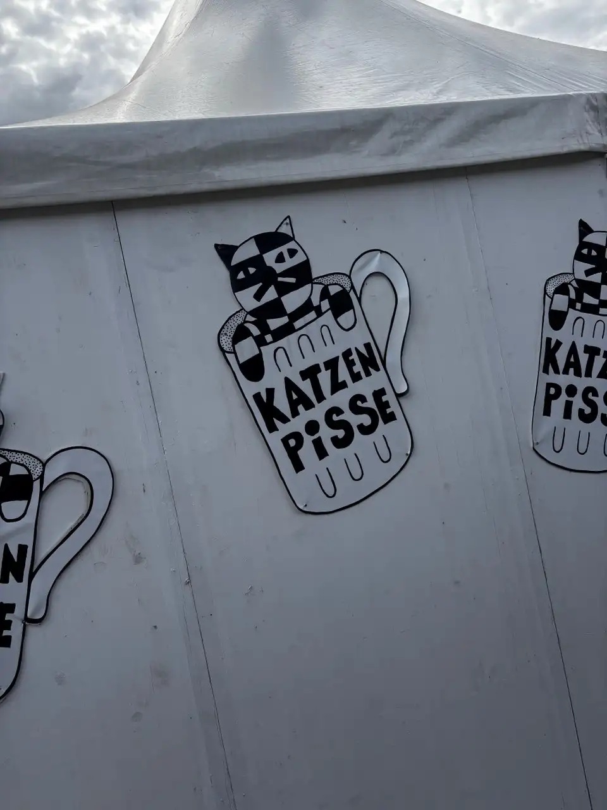
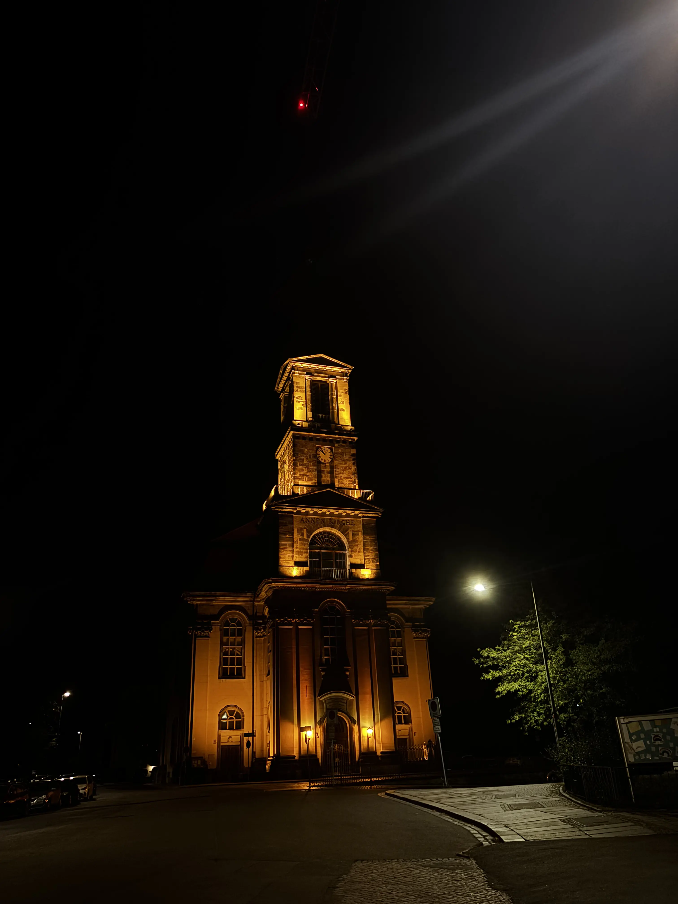
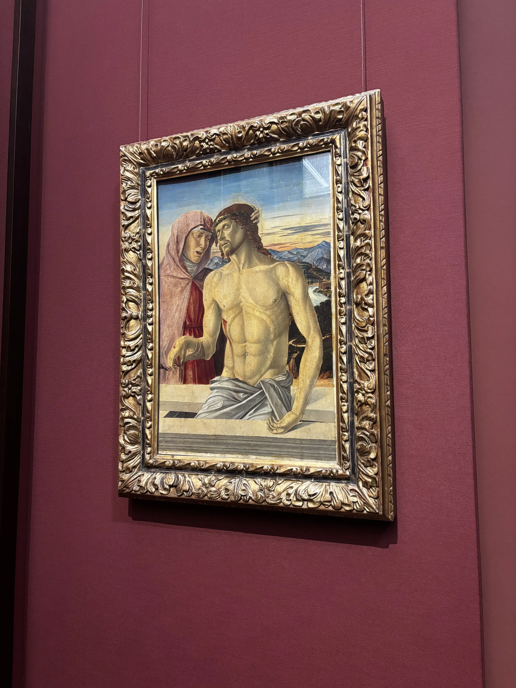

Зазвичай я той самий чувак, який більшість часу проводить вдома, розмірковуючи, чи варто взагалі виходити на вулицю. Тож так — поїздка для мене це завжди *велика подія*. Дрезден у підсумку вийшов сумішшю блукань без плану, дрібних сюрпризів, дивних моментів і, звісно ж, пива. Багато пива.

Не очікуйте нічого серйозного від цієї нотатки — просто попереджаю 😋

## Grand Garden Palace

Першою зупинкою став Grand Garden Palace і парк навколо. Красиво — без варіантів. Через парк їздить маленький поїзд. Дуже спокусливо. Чи сів я в нього? Ні. Не зміг дозволити собі бути настільки дитиною... може, наступного разу. 🥲

А потім стався **момент з Polaroid'ом** (здається, це був Polaroid?). Літня пара дала мені вінтажну камеру й попросила зробити фото. У моїй цифровій голові логіка проста: *клік = фото*. Реальність сказала «ні». Тут треба **тримати** кнопку. Натиснув — відпустив — нічого. Ще раз — знову нічого. І після кожної спроби вони підходили перевірити, чи вже готово. Чувак на п'ятій спробі вже був типу:

День закінчився на терасі з гарним видом, напоєм і однією з тих довгих розмов, після яких починаєш задумуватись про життя трохи глибше, ніж зазвичай. Відрив від рутини якось дивно впливає на голову: думаєш, куди все котиться, що взагалі відбувається... і чому, чорт забирай, ти не сів у той маленький поїзд. 😔

## Абсолютно унікальний маршрут

Наступний день: Altstadt. Theaterplatz, Frauenkirche, Dresdener Hofkirche — всі ці барокові картинки раптом стають реальністю.

|                                                               |                                                                                          |                                                                                  |
| ------------------------------------------------------------- | ---------------------------------------------------------------------------------------- | -------------------------------------------------------------------------------- |
|  |  |  |

Звісно, після такого — час для першого офіційного ритуалу поїздки: ірландський паб. І серйозно, в мене питання — **чому в кожному ірландському пабі завжди є телевізор з футболом?** У кожному. Без винятків. Матчів настільки багато? Чи це якийсь негласний закон? Як би там не було, атмосфера завжди топ: шумно, затишно, живо. Саме те.

Так, це Кока-кола. Звідки ти знаєш?

## Katzenpisse

Деякі дні — це просто блукання. Так я випадково натрапив на фестиваль [Katzenpisse](https://www.kulturkalender-dresden.de/festival/karierte-katze), просто йдучи вулицями, де ще не був. Рандомно, дивно і ідеально. Той день ще раз підтвердив: жорсткі плани — переоцінені, а пиво — ні. Коли компанія класна, будь-яка вулиця, фестиваль чи кут міста стає цікавою. Люди > місця. Завжди.

|       |       |
|-------|-------|
|  |  |

А, і там ще була класна музика! Як я тільки міг забути 🙈

## Зоопарк

День зоопарку! Зазвичай зоопарки — не моя тема, але в Дрездені є пінгвіни. А пінгвіни — об'єктивно милі. За той день з'явилась абсурдна кількість фото, більшість з яких залишиться приватними. Серйозно, кому вони потрібні?  Енівейс, тримайте:

|                                                         |                                                       |                                                     |
| ------------------------------------------------------- | ----------------------------------------------------- | --------------------------------------------------- |
|  |  |  |

Після цілого дня ходіння бути втомленим — абсолютно нормально. Тим більше, що в кінці дня, звісно ж, було пиво. Починаю ловити себе на думці, що люди навколо можуть сприймати мене як алкоголіка 🌚 — хоча я реально не з тих, хто багато п'є.

Low-key pa~~ran~~laroid з цього приводу, low-key окей.

## Sächsische Dampfschifffahrt

А потім була [Sächsische Dampfschifffahrt](https://www.saechsische-dampfschifffahrt.de/). Дивитись ці кораблі цілий тиждень і не піти? Неможливо. Квиток куплений. Головний інтерес — пиво на борту. Другорядний — види міста. Німецькі міста в цьому плані кумедні: готика, ренесанс, бароко — усе знайоме, але все одно якось дивують.

|                                                 |                                                                                  |                                                                                          |
| ----------------------------------------------- | -------------------------------------------------------------------------------- | ---------------------------------------------------------------------------------------- |
|  |  |  |

Потім, чілячи у квартирі, я знову усвідомив: ~~люди~~ пиво, з яким ти поруч, важливіше за плани, пам'ятки і навіть ідеальний захід сонця.

Ах так, чи я вже згадував, що це була початково **екскурсія з гідом**, а не просто покатушки з пивом? Фігня якась, скажіть? 🧟‍♂️  

## Дрезден вночі

Дрезден вночі заслуговує на окремий абзац. Вуличні музиканти, статуї всюди, тихі вулиці, які дивним чином відчуваються затишними. Йдеш, говориш — і слів раптом бракує.

Проходячи повз усі ці статуї, я ловив себе на думці: а раптом вони засуджують моє пивозарство. Prolly, так.

Я побоявся цього кам'яного осуду, тож фото статуй у моїй бібліотеці нема взагалі. Тому просто рандомні кадри і відео:

|                                                                                   |                                                                                    |                                                                                           |                                                                                   |
| --------------------------------------------------------------------------------- | ---------------------------------------------------------------------------------- | ----------------------------------------------------------------------------------------- | --------------------------------------------------------------------------------- |
|  |  |  |  |

## Це точно варто знати

Музеї — окрема історія. Чотири години — і все одно лише поверхнево. Додай сюди суші (вперше за рік!) і, звісно, ще одне пиво. Традицію дотримано. Інтеграція в Німеччину пройшла успішно. ☝️

Більше без пруфів пиття алкоголю, мені ж треба якщо що потім виправдовуватись 🥾🔄

|                                                   |                                                   |                                                        |
| ------------------------------------------------- | ------------------------------------------------- | ------------------------------------------------------ |
|  |  |  |

Перед від'їздом — ще пара пив у випадковому барі-ресторані. Якось непомітно це стало щоденною штукою. Найкращий опис цього всього:

<iframe src="https://www.youtube-nocookie.com/embed/oX1vp-fblx8?si=l3bh4tqDswrGLjJ8&amp;start=27" title="YouTube video player" frameBorder="0" allow="accelerometer; autoplay; clipboard-write; encrypted-media; gyroscope; picture-in-picture; web-share" referrerPolicy="strict-origin-when-cross-origin" allowFullScreen></iframe>

## Щось, можливо, важливе

Висновки? Блукай без жорстких планів. Цінуй випадкові моменти — пінгвінів, фестивалі, маленькі поїзди, фейли з Polaroid'ом. Не будь надто серйозним. Люди важливіші за місця. І не повторюй мою помилку — якщо хочеш сісти на маленький поїзд, **сідай** гад дем' іт. Сіріеслі.

А в Німеччині пиво — це, здається, обов'язковий туристичний аксесуар. І чесно? Воно реально робить усе кращим.
