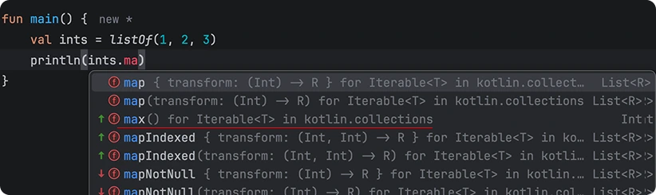

З розвитком програмування розвивалися і способи структурування коду. Ранні програми були простими прямолінійними послідовностями інструкцій, а повторне використання досягалося переважно шляхом копіювання та вставки. З часом це призвело до впровадження абстракцій, таких як підпрограми, процедури та функції, а пізніше — до підходів вищого рівня, як-от об'єктно-орієнтоване програмування.

Прогрес не зупиняється, і кожна мова приносить свої власні конвенції, які формують те, як код пишеться і читається. Сьогодні ми обговоримо розширено-орієнтоване проєктування (Extension-Oriented Design) у Kotlin — що це таке і чому розширення (extensions) — це більше, ніж просто обхідний шлях для класів, якими ви не володієте.

## Функції-розширення в Kotlin
Почнемо з короткого вступу для читачів, які є новачками в Kotlin — або не використовують його щодня, але все ж цікавляться.

> **Функції-розширення в Kotlin** — це фіча мови, яка дозволяє додавати **нову поведінку до існуючого типу без його модифікації або успадкування від нього**.

У більшості об'єктно-орієнтованих мов класичним способом розширення функціональності є **успадкування**. Це працює, допоки ви володієте класом або успадкування є можливим — наприклад, коли тип не є примітивом, фінальним (`final`), запечатаним (`sealed`) або не має занадто багато реалізацій для розумного та адекватного розширення.

У Java це обмеження зазвичай вирішується введенням так званих класів *helper* або *utils* (назви варіюються, ідея — ні). Наприклад, додавання функції для пошуку максимального елемента в списку часто виглядає так:
```java
public final class ListUtils {
	private ListUtils() {}
	
	public static Integer max(List<Integer> values) {
        if (values == null || values.isEmpty()) {
            return null;
        }

        int max = values.get(0);

        for (int i = 1; i < values.size(); i++) {
            int value = values.get(i);
            if (value > max) {
                max = value;
            }
        }

        return max;
    }
}
```

Чисто технічно можна було б обернути `List` в інший клас, щоб надати додаткову функціональність за допомогою [патерну делегування](https://uk.wikipedia.org/wiki/%D0%A8%D0%B0%D0%B1%D0%BB%D0%BE%D0%BD_%D0%B4%D0%B5%D0%BB%D0%B5%D0%B3%D1%83%D0%B2%D0%B0%D0%BD%D0%BD%D1%8F). На практиці це робиться рідко. Уявіть, що ви створюєте список за допомогою `List.of(...)`, а потім знову обертаєте його в `FooList<E>` лише для того, щоб отримати одну додаткову операцію — це створює непотрібну церемонію і часто додаткові алокації при дуже малій вигоді. Як результат, статичні методи утиліт залишаються домінуючим підходом. Це працює, але має свої компроміси.

Ви повинні знати про існування `ListUtils`, пам'ятати його назву і сподіватися, що він дотримується передбачуваної конвенції іменування. У реальних кодових базах ці класи мають тенденцію розростатися, розмножуватися з часом і фрагментуватися на кілька варіантів. Пошук існуючої допоміжної функції часто перетворюється на нескінченне страждання, а пізніше – в дублювання реалізацій просто тому, що хтось не знав про вже існуючу функціональність.

Kotlin вирішує це за допомогою **функцій розширення** (extension functions). Замість пошуку допоміжного класу ви шукаєте поведінку, визначену *на самому типі*:
```kotlin
fun Iterable<T : Comparable<T>>.max(): T { /* ... */ }
```


Це значно полегшує виявлення функціональності. Вона виражається "на типі", якому вона належить, а не приховується за довільною та рандомною назвою класу утиліт.

Тим не менш, розширення Kotlin іноді сприймаються лише як спосіб обійти обмеження мови. Поширеним прикладом є неможливість оголосити *final* член в `interface`, хоча деякі функції за своєю природою є фінальними — наприклад, ті, що покладаються на `reified` параметри типів:
```kotlin
interface Serializer {
  fun <T> encode(kClass: KClass<T>, value: T): String
}

inline fun <reified T> Serializer.encode(value: T): String {
  return encode(T::class, value)
}
```

Тут інлайнове розширення призначене для того, щоб **делегувати роботу базовій функції**, не додаючи нової поведінки. Його мета полягає виключно в забезпеченні зручнішого використання в місці виклику, а не в зміні того, що робить оригінальна функція. Навіть якби мова дозволяла перевизначати її, це було б недоцільно, оскільки це могло б порушити це делегування та очікуваний контракт, якби хтось перевизначив її неочікуваним чином.

Але чи це єдине використання розширень? Насправді ні.

## Розділення основи та можливостей
Тепер до найцікавішого — як розширення допомагають поза межами обходу обмежень мови? Але почнемо з певного визначення:
> **Проєктування орієнтоване на розширення (Extension-Oriented Design)** — це підхід, при якому **основні можливості** типу залишаються мінімальними та стабільними, тоді як **похідна, комбінаційна або допоміжна поведінка** виражається через розширення — незалежно від того, чи ви володієте типом, чи ні.

Хоча розширення часто використовуються для класів, якими ми не володіємо, право власності не є головним. Головне — **відокремити те, чим тип *є*, від того, що з ним можна *зробити***.

Гарним прикладом є `Flow<T>` у `kotlinx.coroutines`. Інтерфейс `Flow` навмисно зроблений мінімальним і побудований навколо **однієї основної можливості**: `collect`. Все інше походить від неї.

Концептуально та фізично інтерфейс зводиться до:
```kotlin
public interface Flow<out T> {
    suspend fun collect(collector: FlowCollector<T>)
}
```

Усі операції вищого рівня — `map`, `filter`, `combine`, `flatMapLatest` та багато інших реалізовані як **розширення**, які повторно використовують цей єдиний примітив, замість розширення інтерфейсу.

Наприклад, `map` по суті визначається як:
```kotlin
public inline fun <T, R> Flow<T>.map(
    crossinline transform: suspend (T) -> R
): Flow<R> =
    flow {
        collect { value ->
            emit(transform(value))
        }
    }
```
Extesion-oriented Design робить цю структуру явною. Основа залишається невеликою та зрозумілою; похідна поведінка чітко нашаровується зверху. Це, в свою чергу, спрощує розуміння кодової бази та міркування про абстракцію.

Це також вирішує ширшу проблему, яку часто приносять абстракції: неконтрольоване успадкування. Коли поведінка виражається через методи, які можна перевизначити, стає важче зрозуміти, що насправді відбувається під час виконання. Баг часто перетворюється на гру в здогадки в коді нескінченного ланцюжка успадкування — що могло бути перевизначено і де?

Розширення уникають цього класу проблем за дизайном. Їх неможливо перевизначити, і тому вони не можуть непомітно змінити поведінку. Це не обмеження, а навмисна властивість: контракти залишаються стабільними, похідна поведінка — передбачуваною, а кількість речей, які можуть вплинути на виконання, зменшується.

Як результат, розширення не тільки допомагають структурувати код — вони допомагають зберегти довіру до самої абстракції.

І це техніка не тільки для бібліотек — ви можете застосувати той самий підхід у власному коді. Кілька загальних рекомендацій:
- Визначте невелику, стабільну основну можливість.
- Виражайте все інше як розширення, побудовані на її основі.
- Дозвольте поведінці рости, не роздуваючи основну абстракцію.

У цій моделі розширення не є «додатковими помічниками». Вони є основним способом побудови поведінки, тоді як основа залишається мінімальною та явною.

> Якщо вам цікаво дізнатися про інші приклади цього підходу, ви також можете переглянути вихідні коди [kotlin.Result](https://github.com/JetBrains/kotlin/blob/master/libraries/stdlib/src/kotlin/util/Result.kt#L173) та Ktor. Загалом, уся стандартна бібліотека, `kotlinx.coroutines`, Ktor та інші офіційні бібліотеки використовують цей підхід. Чудове джерело натхнення!


## А тепер — до практики
Спробуймо побудувати щось власноруч, щоб по-справжньому закріпити цю ідею. Уявіть, що вам потрібно створити невелику та просту бібліотеку для кешування. Як би ви підійшли до цього з думкою про **extension-oriented design**?

По-перше, нам потрібно визначити **основний функціонал** — мінімальний набір операцій, який повинен підтримувати будь-який кеш. За своєю суттю, кеш робить дві речі:
1. Отримує значення за ключем.
2. Зберігає значення за ключем.

Все інше — це просто зручність, нашарована зверху. Це дає нам чіткий, мінімальний інтерфейс:
```kotlin
interface Cache<K : Any, V : Any> {
    operator fun get(key: K): V?
    // Призначає [value] до [key]. 
    // Якщо [value] є null — видаляє його з кешу
    operator fun set(key: K, value: V?): Boolean
}
```

Цей інтерфейс фіксує **ключові можливості**: `get` та `set`. Він малий, стабільний і передбачуваний. Нічого іншого тут не повинно бути, оскільки все додаткове можна виразити через розширення.

Далі, подумаймо про **досвід використання**. У реальних сценаріях ви часто хочете **прочитати значення або обчислити та зберегти його, якщо воно відсутнє**. Це дуже поширений патерн:
```kotlin
val cachedValue = if (cache[key] != null) {
    cache[key]!!
} else {
    val value = computeValue()
    cache[key] = value
    value
}
```
Писати це щоразу, коли ми працюємо з кешем, досить незручно, чи не так? Ми можемо інкапсулювати цей патерн в **одному розширенні**, залишивши основний інтерфейс недоторканим:
```kotlin
fun <K : Any, V : Any> Cache<K, V>.getOrAssign(key: K, block: () -> V): V {
    return get(key) ?: block().also { set(key, it) }
}
```

Зверніть увагу, як це працює: сам інтерфейс залишається крихітним — лише `get` та `set`. Все інше живе в розширеннях. Тут `getOrAssign` є саме таким розширенням: воно не змінює принципи роботи кешу, а лише додає чіткий і зручний спосіб його використання.

У місці виклику це читається майже як звичайна мова: `cache.getOrAssign(key) { expensiveComputation() }`. Ви одразу розумієте, що відбувається: якщо значення є, використайте його; інакше — обчисліть і збережіть. Назва `getOrAssign` обрана свідомо — ми хочемо, щоб вона чітко вказувала на те, що робить це розширення, не змушуючи нікого здогадуватися.

Краса цього підходу полягає в тому, що ми можемо зберігати стабільність основи, нашаровуючи поведінку передбачуваними та гнучкими способами. Це дозволяє зберігати речі малими, зрозумілими та дає функціоналу можливість розвиватися природним шляхом.

Пізніше ви могли б додати щось на кшлат `invalidate(key: K)` як розширення — і все це без втручання в оригінальний інтерфейс. Це робить API чистішим, ніж використання `set(key, null)`, яке хоч і працює, але виглядає дещо занадто технічно і не є очевидним для того, хто використовує кеш.

## Висновок
Ми використовуємо функції розширення з багатьох причин: щоб обійти технічні обмеження (наприклад, коли клас недоступний для модифікації або коли певні функції, такі як `inline` функції, не можуть бути використані безпосередньо) та структурувати код так, щоб покращити його розуміння.

Розширення не є срібною кулею, і їх не слід застосовувати механічно. Легко перемудрувати (overengineering), але повне ігнорування цього підходу часто призводить до роздутих абстракцій та поганої доступності функцій.

Використовуване свідомо, розширено-орієнтоване проєктування допомагає зберігати основні абстракції невеликими, дозволяючи поведінці рости контрольовано та зрозуміло.

Наприкінці я також дуже рекомендую [статтю Романа Єлізарова](https://elizarov.medium.com/extension-oriented-design-13f4f27deaee) на цю ж тему.
