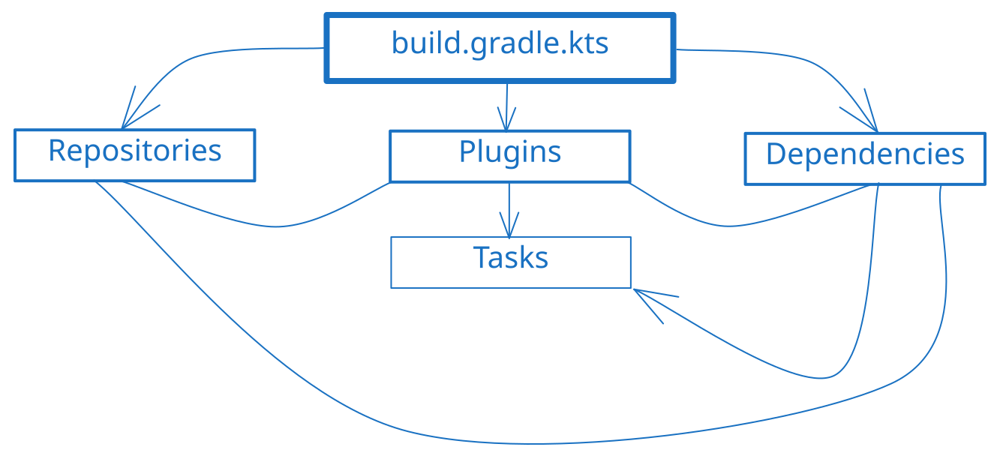
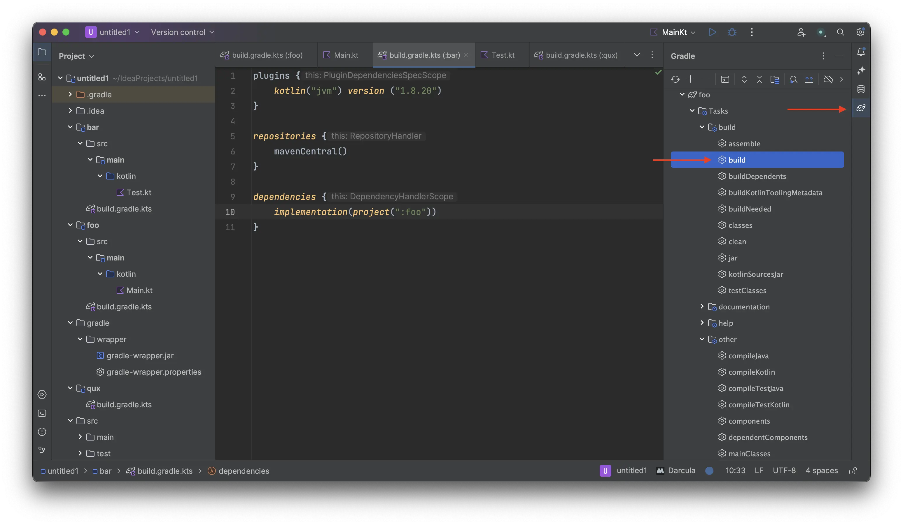
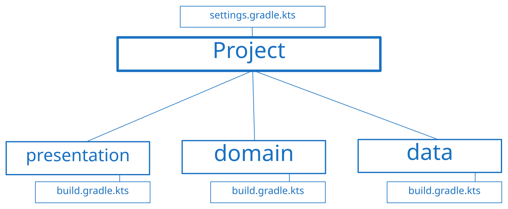

При розробці на Kotlin кожен початківець стикається з проблемою нерозуміння відповідного інструментарію для роботи з мовою програмування. Саме для цього була створена ця стаття — щоб пояснити роботу Gradle для Kotlin і на Kotlin. Поїхали!

> ❓ **Визначення** <br/>
> **Gradle** — це система для автоматизації збирання, включаючи білд (building) та компіляцію. Вона розроблена для складних процесів збірки, де завдання полягає не лише у виконанні коду, але й у створенні власної логіки збірки (як, наприклад, автоматичне тестування), обробці багатомодульних проєктів та інтеграції з системами безперервної інтеграції (CI).

Але почнемо з чогось простого — як створити наш перший проєкт за допомогою Gradle?

## Проєкт
Почнемо з базової концепції, яка існує в системі збірки додатків — Проєкт.

### Визначення

> **Project (Проєкт)** — це незалежна одиниця організації додатку як набору залежних модулів та правил для них.

> **Module (Модуль)** — це незалежна одиниця організації коду, яка має певний набір правил (як він збирається тощо). Існує з тією ж метою, що й пакети (packages) в Kotlin — розділити код на логічні блоки (для повторного використання коду, як в одному проєкті, так і в інших) або ізолювати певний код (наприклад, щоб зробити дотримання архітектурних принципів простіше та очевидніше) для покращення якості вихідного коду.

Про які правила я говорю? Насправді все дуже просто — ми описуємо, як наш проєкт буде збиратися (опис технічних особливостей), для якої платформи (наприклад, Android або iOS), якою мовою та за допомогою яких засобів (залежності проєкту).

### Структура
Давайте створимо приклад структури проєкту:

> P.S: Назви в прикладі не мають особливого змісту, це просто термінологія з [Foobar](https://wikipedia.org/wiki/Foobar).

Всі модулі повинні мати `build.gradle.kts`, щоб працювати. Важливо зазначити, що модулі не можуть існувати самі по собі, і вони працюють лише якщо ми явно включимо їх до нашого проєкту через `settings.gradle.kts`.

Як бачите, у нас є свого роду "головний наглядач" (або "старший менеджер"), який визначає, які модулі будуть у нашому проєкті та як вони будуть працювати, і "місцеві наглядачі" (звичайні менеджери), які встановлюють правила лише для підпорядкованого їм коду (модулів), але варто зазначити, що як у реальному житті "старші менеджери" мають приорітет над "звичайними менеджерами", — **Project** має більший пріоритет, ніж модулі, коли справа доходить до правил (але це не те, що ми будемо розглядати в цій конкретній статті).

Які існують правила? Насправді їх багато — все залежить від того, що ви робите, але основними є, наприклад:
- Назва проєкту, версія, група (ідентифікатор, який є свого роду пакетом з Kotlin)
- Мова програмування (Java / Scala / Groovy / Kotlin / тощо)
- Платформа (Актуально лише для Kotlin, точніше, для плагіна Kotlin Multiplatform)
- Залежності (бібліотеки або фреймворки, що використовуються в коді)

## Модулі
Розглянемо модулі: як і з чим їх їдять. Нагадаю, що таке модуль:
> ❓ **Визначення** <br/>
> **Module (Модуль)** — це незалежна одиниця організації коду, яка має певний набір формальних правил, що визначають поведінку модуля.

Для прикладу візьмемо модуль `foo`:

Щоб створити модуль, перш за все, ми створюємо директорії цього модуля. Після цього ми створюємо файл з назвою `build.gradle.kts` (або `build.gradle`, якщо ви використовуєте Groovy як мову скриптів, іншого шляху немає), де ми вже пропишемо, що наш модуль може робити.

### `build.gradle.kts`
Наш файл налаштувань має наступну структуру:

Не бійтеся! Навіть якщо це виглядає досить складно. 😄

Основним компонентом у будь-якому `build.gradle.kts` є блок **Plugins** (Плагіни). Блоки **Dependencies** (Залежності) та **Repositories** (Репозиторії) є незалежними від блоку Plugins, але без нього вони як коміки, що розповідають жарти в порожньому театрі — у них може бути чудовий матеріал, але немає сцени, немає публіки і не чути сміху.

Плагіни, які застосовуються до вашого модуля, зазвичай споживають те, що ви вказали в блоці **Dependencies**. Отже, залежності без плагінів, які їх використовуватимуть, є марними, тому залежності мають зв'язок з плагінами в нашій схемі.

**Repositories** не залежать від плагінів як таких, але вони завжди потрібні, щоб застосувати будь-які залежності або плагіни до вашого проєкту. Тому без плагінів або залежностей їх існування не має сенсу. Отже, використовуючи нашу попередню аналогію, це схоже на театр, повний людей, без жодного коміка на сцені.

**Tasks** (Завдання) також є фундаментальною річчю у ваших конфігураційних файлах Gradle. Вони майже завжди надаються плагінами, які ви застосовуєте до свого модуля. У порожньому модулі без жодного плагіна у вас не буде жодних завдань. Однак є деякі базові завдання, які доступні на рівні проєкту:
- `tasks` (повертає список доступних завдань у проєкті: назва, від яких завдань залежить завдання тощо).
- `dependencies` (друкує звіт про залежності проєкту, показуючи, які залежності використовуються та їхні версії).
- `help` (повертає список доступних завдань у проєкті з коротким описом).
- `model` (надає детальний звіт про структуру вашого проєкту, завдання тощо; допомагаючи вам зрозуміти та налагодити вашу збірку Gradle).
- тощо.

> **💡 Бонус** <br/>
> Завдання можуть залежати від інших завдань, це особливо корисно, коли вам потрібен результат виконання іншого завдання.

#### Приклад
Тепер розглянемо приклад. Припустимо, створимо Kotlin/JVM проєкт з бібліотекою [kotlinx.coroutines](https://github.com/Kotlin/kotlinx.coroutines) як залежністю.

По-перше, нам потрібно створити файл конфігурації нашого проєкту — `settings.gradle.kts` в корені нашого проєкту:
```kotlin
rootProject.name = "our-first-project"
```

Щоб це запрацювало, ви повинні запустити gradle sync всередині вашої IDE:


Ви можете або створити нову папку для нового модуля, або використати кореневу папку як модуль так само, просто додавши файл `build.gradle.kts` у кореневу директорію (`our-first-project/build.gradle.kts`).

> ❗️ **Важливо** <br/>
> Коли ми використовуємо кореневу папку як модуль, нам не потрібно явно додавати її до файлу конфігурації проєкту, але для будь-яких нових модулів ми повинні оголосити їх за допомогою функції `include` — наприклад, `include(":foo")` (для вкладених папок використовуйте `include(":foo:bar")`).

Почнемо з `plugins`:
```kotlin
plugins {
	id("org.jetbrains.kotlin.jvm") version "1.9.0"
}
```

> **💡 Бонус** <br/>
> Ми можемо спростити оголошення плагінів Kotlin (таких як `jvm`, `android`, `js`, `multiplatform`), використовуючи функцію `kotlin`: `id("org.jetbrains.kotlin.jvm")` -> `kotlin("jvm")`.
> Вона автоматично додає `org.jetbrains.kotlin` на початку.

Тепер перейдемо до Dependencies:
```kotlin
dependencies {
	implementation("org.jetbrains.kotlinx:kotlinx-coroutines-core:1.7.3")
}
```

Наш Kotlin/JVM плагін надає корисну для нас функцію — `implementation`. Без неї нам довелося б явно писати назву конфігурації (ідентифікатор для плагіна), яка буде споживати наші залежності. Як ви можете пам'ятати, залежності не живуть самі по собі. Отже, щоб бути точнішим, блок **Dependencies** надає лише базову можливість додавати та споживати додані залежності. Ми могли б додати нашу залежність наступним чином (але нам все ще потрібен плагін, який буде її споживати):
```kotlin
dependencies {
	add(configurationName = "implementation", "org.jetbrains.kotlinx:kotlinx-coroutines-core:1.7.3")
}
```

> **configurationName** служить для розділення залежностей з різними цільовими плагінами (плагінами, що споживають наші залежності).

Але, якщо ми спробуємо зібрати наш модуль, ми отримаємо наступну проблему:
```text
Could not resolve all dependencies for configuration ':compileClasspath'. > Could not find org.jetbrains.kotlinx:kotlinx-coroutines-core:1.7.3.
```
Щоб вирішити цю проблему, нам потрібно вказати репозиторій, з якого ми хочемо імплементувати нашу залежність. Давайте поглянемо на приклад:
```kotlin
repositories {
	// вбудовані:
	mavenCentral()
	mavenLocal()
	google()
	
	// або вкажіть точне посилання на репозиторій:
	maven("https://maven.y9vad9.com")
}
```

> ❓ **Визначення** <br/>
> <u>Maven repositories (Maven репозиторії)</u> — це як онлайн-магазини або бібліотека для коду. Це колекції попередньо зібраних програмних бібліотек та залежностей, до яких ви можете легко отримати доступ і використовувати у своїх проєктах. Ці репозиторії забезпечують централізований та організований спосіб обміну та розповсюдження коду.
>
> Також важливо зауважити, що Maven — це _інший інструмент збірки_, який підтримується Gradl'ом.

Але для нашого випадку нам потрібен лише `mavenCentral()`. Отже, наш результуючий `build.gradle.kts` виглядає так:
```kotlin
plugins {
	kotlin("jvm") version "1.9.0"
}

repositories {
	mavenCentral()
}

dependencies {
	implementation("org.jetbrains.kotlinx:kotlinx-coroutines-core:1.7.3")
}
```

Для такого прикладу нам не потрібно чіпати жодних завдань. Але було б добре згадати, що наш Kotlin плагін надає такі завдання:
- `compileKotlin`
- `compileJava`
- тощо

Але зазвичай вам не потрібно викликати ці завдання напряму, якщо ви не розробляєте власний плагін, який залежить від результатів/виходів цих завдань.

> 💡 **Бонус** <br/>
> Ви можете запускати завдання gradle або через командний рядок, або через IDE:
>
> 
> Як приклад я взяв завдання `gradle build`.

Ми поки що пропустимо повне пояснення завдань та того, як їх можна використовувати. Я розповім про це в наступних статтях.

Тепер давайте нарешті перейдемо до того, як і де ми можемо писати наш код.

### Source sets (Набори вихідних кодів)
Ми з'ясували, як створити проєкт і модулі, але де ми повинні писати код? У проєктах Gradle існує концепція різних наборів вихідного коду (Source sets) — свого роду розділення коду для різних потреб. Наприклад, за замовчуванням існують наступні набори для нашого попереднього прикладу:
- `main` — Назва говорить сама за себе, це основне місце, де повинен бути розміщений код.
- `test` — Використовується для коду, пов'язаного з тестуванням. Він залежить від набору `main` і має всі залежності / код, який ви написали в `main`.

> 💡 **Бонус** <br/>
> Але це не завжди так, наприклад, [Kotlin/Multiplatform проєкти](https://kotlinlang.org/docs/multiplatform.html) мають виділені source sets для кожної платформи, для якої ви пишете (по суті, плагін створює набір source sets для всіх платформ, які нам потрібні). Тому важливо зазначити, що це завжди залежить від плагінів, які ви застосовуєте до модуля, і від вашої конфігурації. Це не константа.

#### main

Щоб почати кодувати, нам потрібно створити папку для нашої мови програмування, для Kotlin це папка `src/main/kotlin`. Отже, відтепер ми можемо просто створити наш проєкт 'Hello, World!'. Створимо `Main.kt` у нашій нещодавно створеній папці:
```kotlin
fun main() = println("Hello, Kotlin!")
```
Ви можете запустити його за допомогою IDE, вона автоматично обробить процес збірки Gradle.

#### test
Як я вже казав вам раніше, цей source set використовується для цілей тестування. Але важливо зазначити, що він має свої власні залежності (але він також форкає їх з `main` source-set). Отже, ви можете імплементувати залежності, які будуть доступні в цьому source-set. Наприклад, давайте імплементуємо бібліотеку `kotlin.test`:
```kotlin
dependencies {
	// ...
	testImplementation(kotlin("test"))
}
```

Ви можете звернутися до [повного посібника](https://kotlinlang.org/docs/jvm-test-using-junit.html) в документації Kotlin про те, як ви можете тестувати свій код, використовуючи `kotlin.test`.

## Багатомодульні проєкти (Multi-module projects)
Створення різних модулів створює потребу в їх взаємодії один з одним. Також проаналізуємо типи взаємодії, як не можна або не варто робити, і в чому сенс. Почнемо!

Якщо ви пам'ятаєте нашу [початкову структуру проєкту](#Структура), вона має кілька модулів:
- `foo`
- `bar`
- `qux`

Давайте розглянемо `foo` як основний модуль, де у нас є точка входу в додаток (файл `Main.kt`). Почнемо зі створення конфігурації для всіх трьох модулів (вона буде простою без будь-яких залежностей):
```kotlin
plugins {
	kotlin("jvm") version ("1.9.0")
}

repositories {
	mavenCentral()
}
```

Щоб це запрацювало, додамо наші модулі до `settings.gradle.kts`:
```kotlin
rootProject.name = "example"

include(":foo", ":bar", ":qux")
```

Потім зробимо `foo` залежним від модуля `bar`:
```kotlin
// Файл: /foo/build.gradle.kts

dependencies {
	implementation(project(":bar"))
}
```

> ❗️ **Важливо** <br/>
> Щоб імплементувати модуль з вашого проєкту, ви повинні вказати його за допомогою функції `project`. При імплементації модулів або вказуванні їх десь в іншому місці ми використовуємо спеціальну нотацію, де `/` заміняється на символ `:`.
>
> І бонус: щоб імплементувати кореневий модуль, просто використовуйте `implementation(project(":"))`.

Відтепер ми можемо використовувати будь-яку функцію або клас з `bar` всередині модуля `foo` (звісно, якщо видимість цих оголошень це дозволяє). Наприклад, створимо файл у модулі `foo`:
```kotlin
package com.my.project

fun printMeow() = println("Meow!")
```

І ми можемо використовувати це в модулі `foo`:
```kotlin
import com.my.project.printMeow

fun main() = printMeow()
```

Але ми не можемо використовувати це з модуля `qux`. Більше того, якщо ми спробуємо імплементувати модуль `foo`, `bar` все одно залишиться недоступним. Залежності модуля не відкриваються іншим модулям за замовчуванням.

> 💡 **Бонус** <br />
> Ми можемо ділитися залежностями для модулів, які імплементують наш конкретний модуль, використовуючи функцію [`api`](https://docs.gradle.org/current/userguide/java_library_plugin.html#sec:java_library_separation) замість `implementation`. Таким чином, наприклад, модуль `qux` може отримати доступ до функцій/класів/тощо модуля `bar`, імплементуючи `foo` без явної залежності від модуля `bar`.

### Обмеження
Уявіть, що після попереднього прикладу вам потрібно отримати будь-який клас/функцію/тощо всередині `bar` з модуля `foo`. Якщо ви спробуєте це зробити, ви отримаєте наступну проблему:
```
Circular dependency between the following tasks:
:bar:classes
\--- :bar:compileJava
     +--- :bar:compileKotlin
     |    \--- :foo:jar
     |         +--- :foo:classes
     |         |    \--- :foo:compileJava
     |         |         +--- :bar:jar
     |         |         |    +--- :bar:classes (*)
     |         |         |    +--- :bar:compileJava (*)
     |         |         |    \--- :bar:compileKotlin (*)
     |         |         \--- :foo:compileKotlin
     |         |              \--- :bar:jar (*)
     |         +--- :foo:compileJava (*)
     |         \--- :foo:compileKotlin (*)
     \--- :foo:jar (*)
```
Про що це все? Все просто — ви не можете створювати циклічні залежності.

Циклічні залежності в Gradle схожі на нескінченний цикл, який змушує ваш процес збірки застрягти, оскільки завдання (у нашому випадку `compileKotlin`) продовжують чекати одне на одне, щоб завершитися, що ніколи не відбудеться (одне не може скомпілюватись без іншого). Важливо уникати їх, щоб ваша збірка проходила гладко. Крім того, це завжди порушення [**Dependency Inversion Principle (Принципу інверсії залежностей)**](https://uk.wikipedia.org/wiki/%D0%9F%D1%80%D0%B8%D0%BD%D1%86%D0%B8%D0%BF_%D1%96%D0%BD%D0%B2%D0%B5%D1%80%D1%81%D1%96%D1%97_%D0%B7%D0%B0%D0%BB%D0%B5%D0%B6%D0%BD%D0%BE%D1%81%D1%82%D0%B5%D0%B9), що не є хорошою практикою.

Ви можете звернутися до [цього обговорення](https://discuss.gradle.org/t/gradle-support-for-cyclic-dependencies/14355), щоб прочитати про це більше.

> 👨🏻‍🏫 **Бонус для досвідчених** <br />
> Зазвичай, якщо ми говоримо, наприклад, про мобільні додатки, ми використовуємо трьохрівневу архітектуру (Three-Tier Architecture). Тому гарною ідеєю є розділення її на різні модулі для забезпечення архітектурних правил:
> 
> Це робить, наприклад, наш `domain` шар незалежним від `data` шару — це буквально неможливо, оскільки виникне проблема циклічної залежності.

## Висновок
Це не просто ще один спосіб заварювання кави; це потужний інструмент автоматизації збірки, який спрощує ваш процес розробки програмного забезпечення. З Gradle ви можете керувати залежностями, автоматизувати завдання та тримати ваші проєкти добре організованими. Це як мати надійного помічника, який піклується про дрібниці, щоб ви могли зосередитися на написанні чудового коду!
