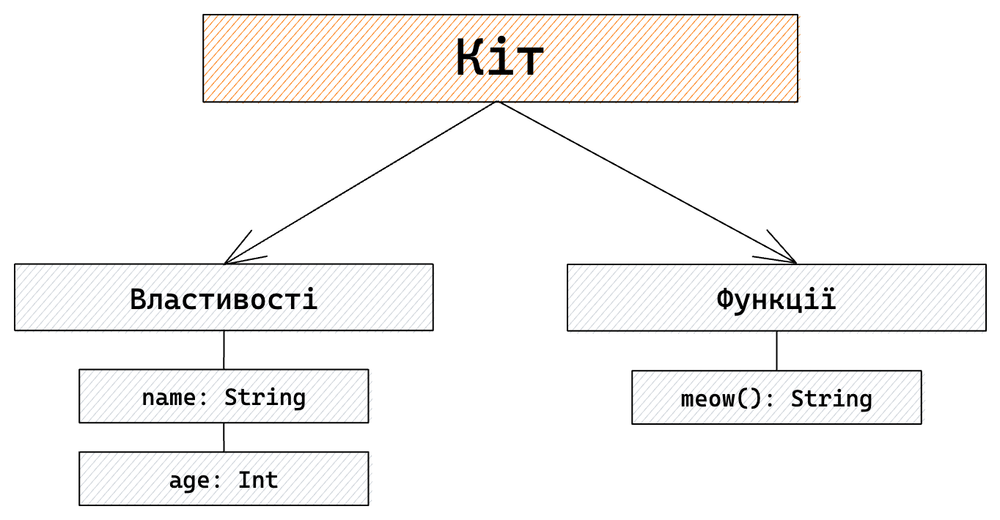

# Об'єкти
Щоб краще зрозуміти, як працюють об'єкти у програмуванні, візьмемо приклад із реального життя. Нехай це буде ваш домашній вихованець — кіт.

Розглянемо його як об'єкт. У нього є ідентифікатор (назва), властивості (ім'я, вік) та функції (наприклад, нявкання).



## Властивості
Властивість — це те саме, що й змінна, тільки вона прив'язана до конкретного об'єкта.

## Функції
Ми вже знаємо, що таке функції. Різниця лише в тому, що для виклику функції об'єкта нам потрібен сам цей об'єкт.

> **ℹ️ Інформація** <br/>
> Область видимості властивостей та функцій обмежується самим об'єктом. Вони доступні лише тоді, коли доступний сам об'єкт і вони не позначені як `private`.

## Kotlin
Для створення одиничного об'єкта в Kotlin використовується ключове слово `object`. Назви об'єктів завжди пишуться з великої літери (**UpperCamelCase**).

```kotlin
object Cat {
    val name: String = "Мася"
    val age: Int = 4
    
    fun meow(): String {
        return "meow <3"
    }
}
```

Щоб отримати дані з об'єкта, ми просто звертаємося до нього за іменем:
```kotlin
fun main() {
    println("Кіт ${Cat.name} віком ${Cat.age} сказав ${Cat.meow()}.")
}
```

> **💡 Додатково** <br/>
> У прикладі вище ми використовуємо `${Cat.name}`, оскільки `Cat.name` — це вираз (перша частина не є змінною).

> **💡 Потрібно знати** <br/>
> Об'єкти також мають свої області видимості. Якщо ви позначите об'єкт або властивість всередині як `private`, вони не будуть доступні ззовні:
> ```kotlin
> object Cat {
>     private val name = "Мася" // Недоступно з main()
> }
> ```

А що робити, якщо у нас декілька котів? Розберемо в наступній темі про класи.