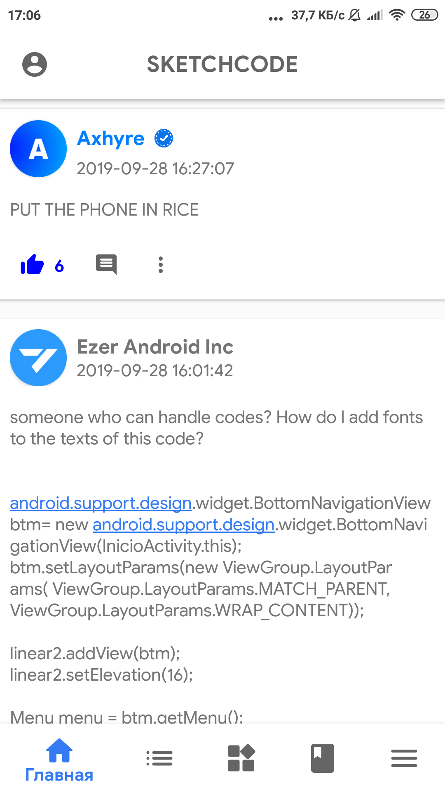
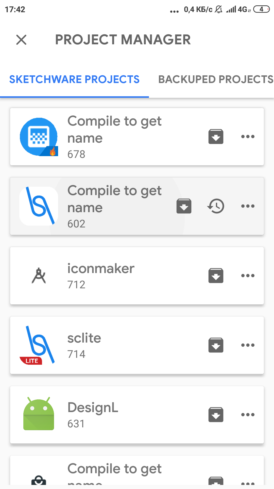
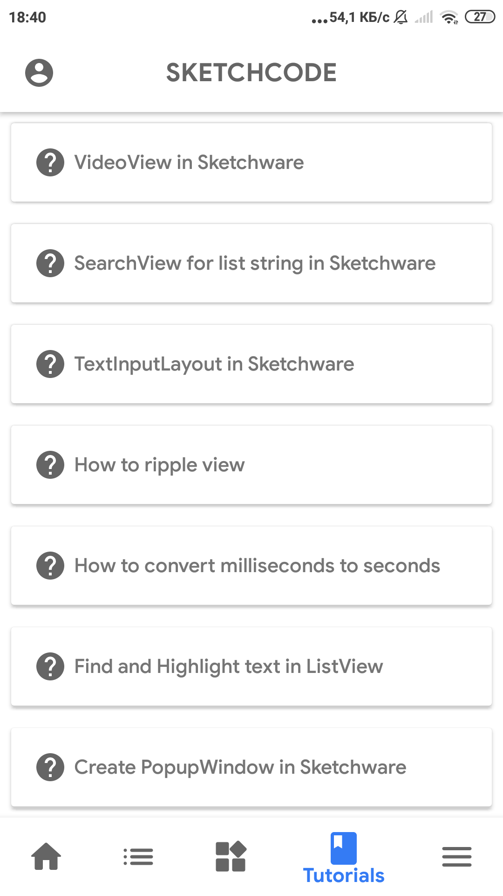
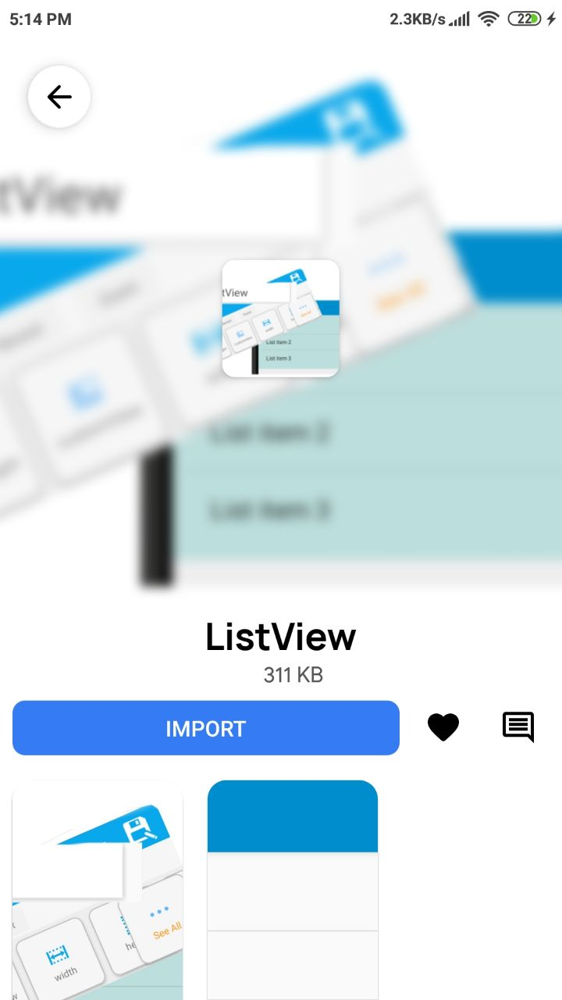

> У 2018 році я створив Sketchcode, соціальну мережу для розробників, які використовують [Sketchware](https://sketchware-docs.vercel.app/) — конструктор Android-додатків без коду (no-code). Це було не просто місце для обміну проєктами; це стало центром для туторіалів, UI-компонентів та співпраці. На піку своєї популярності Sketchcode підтримував 3000 активних користувачів з мізерним бюджетом. Управління ним навчило мене більшого, ніж просто кодування — це навчило мене стійкості та винахідливості.

## Скріншоти
|                                                                                                         |                                                                                                                 |                                                                                                         |
|---------------------------------------------------------------------------------------------------------|-----------------------------------------------------------------------------------------------------------------|---------------------------------------------------------------------------------------------------------|
|        |          |              |
|  |        |          |
|        |  |  |
> Примітка: На жаль, у мене не так багато скріншотів (включаючи те, як змінювався додаток), тому я надаю лише ті, які знайшов.

## Історія

Ця сторінка присвячена розповіді історії Sketchcode, мого найпершого проєкту, який починався як додаток для [Sketchware](https://sketchware-docs.vercel.app/), створений за допомогою самого Sketchware. Це була праця любові, яка вийшла далеко за межі розробки no-code, зрештою перейшовши в Android Studio та Java, що ознаменувало початок мого шляху в програмуванні.

### Перші кроки: Глобальна стрічка та кастомні блоки

Перший реліз Sketchcode представив кілька основних функцій, розроблених для спільноти Sketchware:

- Глобальна стрічка, де користувачі могли знаходити та ділитися контентом.
- Кастомні блоки, які користувачі Sketchware могли легко інтегрувати у свої проєкти.
- Фрагменти коду (сніпети), що дозволяли більш просунутим користувачам включати сирий Java-код через спеціальний будівельний блок.

Ці функції заклали основу Sketchcode і зробили його незамінним інструментом для користувачів Sketchware, які прагнули розширити свою творчість.

### Друга велика версія: Спільнота та Туторіали

Другий великий реліз вивів додаток на новий рівень, надавши спільноті можливість ділитися своїми власними творіннями:

- Функція обміну кастомними блоками та сніпетами, що полегшило співпрацю користувачів.
- Новий розділ туторіалів, що містив посібники, написані мною, щоб допомогти користувачам почати роботу.
- UI-конструктор для туторіалів, щоб користувачі могли створювати та ділитися власним навчальним контентом.

> Примітка: На жаль, у мене немає скріншотів з тієї версії, тому я надаю лише ті, що знайшов.

Ця версія перетворила Sketchcode на простір для співпраці, сприяючи навчанню та творчості.

### Третя велика версія: Проєкти та Приватні резервні копії

Третя велика версія представила ключові нові функції для підтримки та демонстрації користувацьких проєктів:

- Нова функція, що дозволяла користувачам ділитися своїми постами та проєктами Sketchware зі спільнотою.
- Функція приватних проєктів для тих, хто хотів мати безпечну резервну копію своєї роботи.

Це оновлення закріпило статус Sketchcode як центру для користувачів Sketchware, де вони могли спілкуватися, співпрацювати та зберігати свої роботи.

### Четверта велика версія: Великі зміни в UI та функції залучення

Четвертий великий реліз був повністю присвячений покращенню залучення користувачів та оптимізації досвіду:

- Оновлений UI (інтерфейс), що надав додатку сучасний вигляд та кращу зручність використання.
- Покращення Маркету Проєктів, включаючи коментарі, лайки та інші соціальні функції.

Підтримка функції проєктів була значним викликом. Маючи понад 60 ГБ серверного сховища та немонетизований, безкоштовний для всіх підхід, я витратив незліченну кількість годин на оптимізацію файлових структур та стиснення спільних проєктів, щоб сервіс працював безперебійно.

### Пік: 3-4 тисячі користувачів

На піку популярності Sketchcode мав 3000–4000 користувачів, генеруючи понад 10 мільйонів запитів на місяць. Це був захоплюючий, виснажливий і глибоко винагороджуючий час. Я часто працював ночами, рухомий азартом створення та покращення чогось, що люди щиро любили використовувати.

### Остання велика функція: Система чату

Останньою великою функцією, яку я представив, був простий функціонал чату з підтримкою зображень та стікерів. Це дало користувачам можливість спілкуватися в реальному часі, ще більше посилюючи відчуття спільноти всередині додатку.

### Роздуми

Озираючись назад, Sketchcode був більше, ніж просто додатком. Це був мій вхід у програмування і проєкт, який підштовхнув мене до зростання так, як я ніколи не уявляв. Від скромних починань у Sketchware до створення надійної, багатофункціональної платформи — це залишається визначальним моментом у моєму шляху як розробника.
