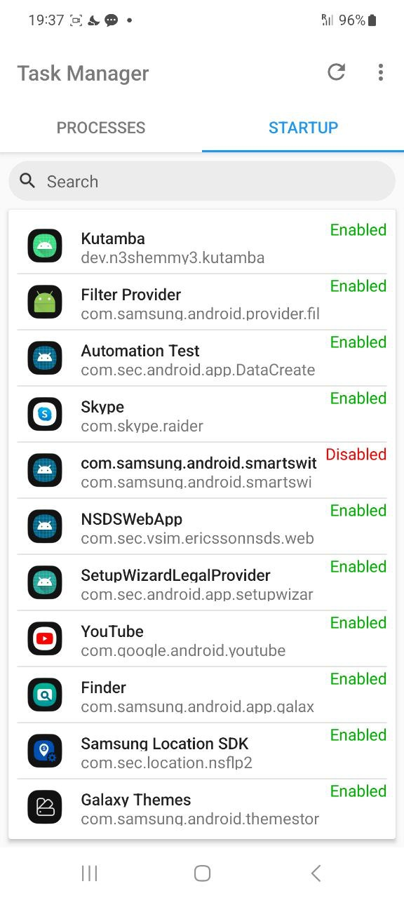

> Task Manager був мобільним додатком, розробленим для того, щоб допомогти користувачам керувати додатками автозавантаження свого пристрою, активними процесами та використанням оперативної пам'яті (RAM). Завдяки зручному інтерфейсу та потужній функціональності він надавав користувачам ефективний спосіб оптимізувати продуктивність свого пристрою.

## Особливості

- Увімкнення або вимкнення програм, що запускаються під час завантаження телефону.
- Перегляд та завершення запущених процесів для звільнення системних ресурсів.
- Оптимізація використання пам'яті для кращої продуктивності шляхом автоматичного клін-апу.

## Досягнення

- **70,000+ завантажень**: Додаток було завантажено понад 70 тисяч разів.
- **7,000 щомісячних активних користувачів**: На піку популярності додаток мав 7 тисяч активних користувачів на місяць.

## Скріншоти

|  |  |  |
| --- | --- | --- |
|  |  |  |
